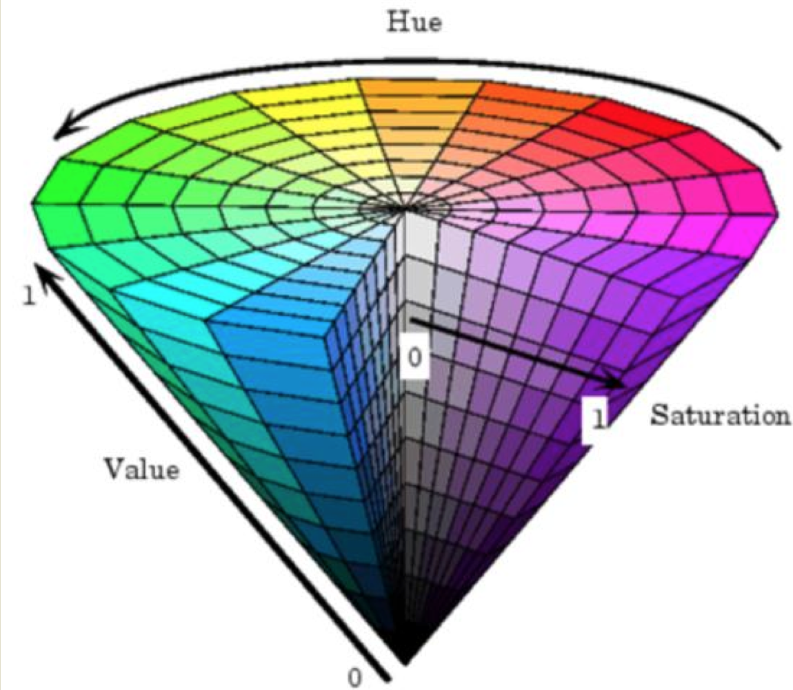
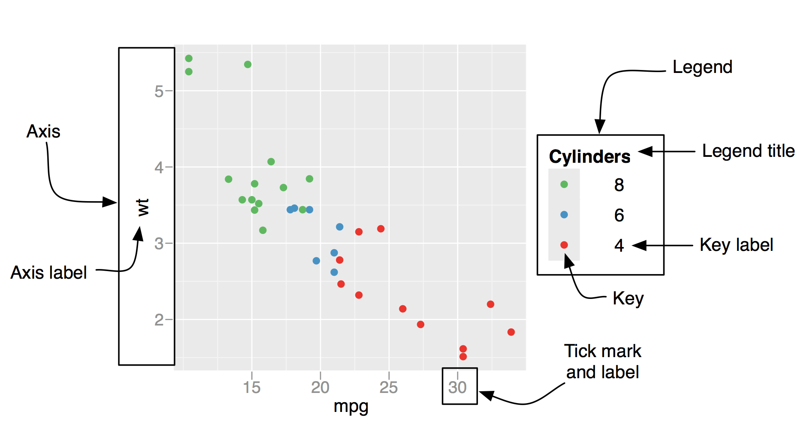
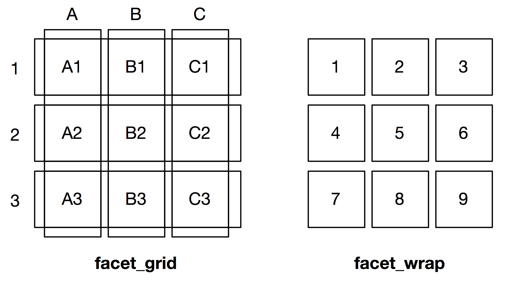

# |[点](https://github.com/gahoo/BGIggplot2Tutorial/)扫我下教程：

# R
## R的历史
* Scheme
    - 一种函数式编程语言，是Lisp的两种主要方言之一
* S-PLUS
    - S语言的一种商业实现
* R
    - S语言的一种开源实现，语法来自Scheme。
    
* Ross Ihaka & Robert Gentlemen
    - 

<aside class="note">
  <section>
  最早的时候，Ross Ihaka、注意到了Scheme和S语言二者之间的异同点，萌生了改进S语言的想法。

  相当长一段时间之后，Ross Ihaka和Robert Gentlemen在奥克兰大学成了同事，因为在商业软件中找不到他们想要的，这使Ross想到当初改进S语言的想法，于是他们决定自己开发一种语言。

  1993年，Ross和Robert将R的部分二进制文件放到了卡耐基·梅隆大学统计系的Statlib中，并在S语言的新闻列表上发布了一个公告。
  Martin极力劝说两位原作者公布源代码，让R成为自由软件。于是1995年6月R的源代码正式发布到了自由软件协会的FTP上。

  1997年中期R核心团队成立  

  从2004年起至今（2005年除外），R团队每年都会举办一次useR!会议，过去已经在奥地利、美国和德国举办了多次会议，每年参会人数和演讲篇数都在增多。

  从2008年至今（2014年9月），统计之都已经在国内举办了7届R语言会议。除了来自大学的学者，百度，京东，腾讯，微软等传统互联网公司也有参会。会议内容涵盖商业、大数据、生物信息等领域
  </section>
</aside>

## R能做什么

- 统计分析：包括统计分布，假设检验，统计建模
- 金融分析：量化策略，投资组合，风险控制，时间序列，波动率
- 数据挖掘：数据挖掘算法，数据建模，机器学习
- 互联网：推荐系统，消费预测，社交网络
- 生物信息学：DNA分析，物种分析
- 生物制药：生存分析，制药过程管理
- 全球地理科学：天气，气候，遥感数据
- 数据可视化：静态图，可交互的动态图，社交图，地图，热图，与各种Javascript库的集成
- 其他：幻灯片，游戏

<aside class="note">
  <section>
    <div style="height:550px;overflow-y: scroll">
  @Conan_Z
  http://blog.fens.me/r-game-snake/
  
  http://blog.fens.me/r-game-2048/
  
  </div>
  </section>
</aside>

## R中的绘图系统
* base

* gird
    - lattice
    - ggplot2

* other
    - vcd
    - plotrix
    - gplots
    - pheatmap

<aside class="note">
  <section>
- base基础图形系统是从S语言中来的，一开始就存在于R语言中。高级绘图函数`plot` `hist` `boxplot`，低级绘图函数`lines` `points` `rect`
- gird网格图形系统是后来加入R中的，与base的最大区别在于，gird能创建多个绘图区域，叫做*viewports*。gird只是一个框架，本身不能够直接绘图
- lattice软件包构建于gird之上，原本是贝尔实验室为S与S-PLUS语言开发的，实现了网格（分面）绘图。
- ggplot2同样采用了gird，吸取了基础绘图系统与lattice的优点，基于图形的语法模型。使得绘图变得便捷可控。
- 其他软件包开发了一些针对特殊需要的图形
  </section>
</aside>

## ggplot2
* Leland Wilkinson
    - The Grammar of Graphics, Springer, 1999.
* Hadley Wickham
    - 2005, ggplot2实现了Grammar of Graphics的基本理念
    
* 设计理念
    - 将图形拆分为相互独立且可以自由组合的组件。
* 好在哪里？
    - 纸笔 VS 语法
    - 手绘（base） VS 美图秀秀（lattice） VS PhotoShop（ggplot2）

<aside class="note">
  <section>
- 基础图形系统类似纸笔，一块画布，指到哪里画哪里。手绘高手也还是存在的……
- lattice略有改善，可以按分类变量给元素上色。但是参数太多。且面向特定的统计图形，如散点图，直方图等。像美图秀秀之类的修图工具，自带各种滤镜或者特效或者添加水印的功能，但其实比美图秀秀强多了。
- ggplot2实现了图形的语法，将图形拆分成为相互独立可互相组合的对象。各种图层的叠加，复制黑客帝国里面的史密斯轻轻松松。
  </section>
</aside>

## SOS 学会求助
- help
```{r,eval=FALSE}
help(qplot)
?qplot
??qplot
```
- 邮件列表
- 社区
    - [StackOverflow](http://stackoverflow.com/)
    - [统计之都](http://cos.name/)

## 参考书目


# R数据结构
## R数据结构


## 向量Vector
```{r}
v_number <- c(1, 2, 5, 3, 6, -2, 4)  #numeric
v_bool <- c(TRUE, TRUE, TRUE, FALSE, TRUE, FALSE)  #logical
v_character <- c("one", "two", "three") #character
v_mix<-c(1,TRUE,"one")
```

```{r}
v_number[v_bool]
v_character[1:2]
v_mix
```

## 向量Vector
```{r}
v_character[c(1,3)]
v1 <- c(1, 1, 1, 1, 1)
v2 <- c(1, 2)
v1 * v2
```
## 矩阵Matrix
```{r}
y <- matrix(1:12, nrow=2, ncol=6) 
y
y <- matrix(1:12, nrow=2, ncol=6, byrow=TRUE) 
y
```

## 数组Array
<div class="columns-2" style="height:500px">
```{r}
a <- 1:12
dim(a) <- c(2,3,2)
a
class(a)
dim(a) <- c(2,6)
class(a)
a <- array(1:12, c(2, 6))
class(a)
```
</div>

<aside class="note">
  <section>
  - 矩阵可以认为是特殊的数组，即维度为2的数组
  - 数组可以是高维度的
  </section>
<aside>

## 列表List
```{r}
g <- "My First List"
h <- c(25, 26, 18, 39)
j <- matrix(1:6, nrow=3)
mylist <- list(title=g, ages=h, j)
mylist 
```
## 数据框Data Frame
```{r}
patientID <- c(1, 2, 3, 4)
age <- c(25, 34, 28, 52)
diabetes <- c("Type1", "Type2", "Type1", "Type1")
patientdata <- data.frame(patientID, age, diabetes)
patientdata$status <- c("Poor", "Improved", "Excellent", "Poor")
patientdata$diabetes <- factor(patientdata$diabetes)
patientdata
```
<aside class="note">
  <section>
  - 数据框就像是excel的工作簿
  - 与矩阵或数组不同，数据框的每一列可以是不同类型
  - 数据框可以算是特化的列表，每个元素都是向量，且向量长度相等
  </section>
</aside>

## R数据结构

<aside class="note">
  <section>
  - 普通的标量就是特殊的向量，即只有一个元素的向量
  - 向量加上维度就成了矩阵或者数组
  - 矩阵是维度为二的数组
  - 向量、矩阵、数组都只能存储一种类型的数据，如果有不同类型的数据会自动转换
  - 数据框就像是excel的工作簿
  - 与矩阵或数组不同，数据框的每一列可以是不同类型
  - 数据框可以算是特化的列表，每个元素都是向量，且向量长度相等
  </section>
</aside>

# 面向对象Object-Oriented
## 面向对象
### 一切皆对象
面向对象是一种对现实世界理解和抽象的方法。是指一种程序设计范型，同时也是一种程序开发的方法。对象指的是类的集合。它将对象作为程序的基本单元，将程序和数据封装其中，以提高软件的重用性、灵活性和扩展性。

### 例如
- 钱包
- 手机
- 钥匙

## 面向对象
### 面向对象的三个特征
- **封装**
    - 把客观事物封装成抽象的类，将独立但相关的数据项目打包在一起，并且类可以把自己的数据和方法只让可信的类或者对象操作，对不可信的进行信息隐藏。
- **继承**
    - 即允许把一个给定的类属性自动赋予其更为下属的更特殊化的类。
- **多态**
    - 指由继承而产生的相关的不同的类，同一函数会对不同的对象做出不同的响应

## 面向对象
### 例如手机
- **封装**
    - 打电话，刷微博，拍照
- **继承**
    - 手机 -> 苹果手机 -> 5S土豪金
    - 手机 -> N记手机  -> Lumia 920
- **多态**
    <div class="columns-2" style="height:250px">
    - 拍照，苹果手机拍出来高上大，小米……
    - 砸核桃，诺基亚毫无压力，苹果……
    <br><br><br>
    
    </div>

## 面向对象
### R语言中的面向对象
- S3：列表加上类名属性和调度（dispatch）功能。后者使得泛型函数的使用变得可能。
- S4：增加了安全性，能避免意外防卫不存在的类组件。
- RC（Reference classes,亦被称为S5）：RC对象系统的方法是在类中自定的，而不是泛型函数。

# ggplot2绘图入门
## ggplot2绘图入门
- 图形的语法
- 图层
- 标度
- 坐标系
- 分面
- 主题

# 图形图层语法
## 图形图层语法
统计图形就是从**数据**到`几何对象`（geomertic object）的`图形属性` （aesthetic attributes）的一个**映射**。此外，图形中还可能包含数据的`统计变换` （statistical transformation），绘制在某个特定的`坐标系` （coordinate system）中，而`分面` （facet）则可以用来生成数据不同子集的图形。上述这些独立的图形部件组成了**统计图形**。

- `几何对象geom`：点、线、面
- `图形属性aes`：颜色、大小、形状
- `统计变换stats`：如分组计数，线性模型等
- `标度scale`：数据到图形空间的映射
- `坐标系coord`：笛卡尔、极坐标、地图投影
- `分面facet`：将数据分解为子集

<aside class="note">
  <section>
  - geom:图形元素
  - stat:对数据的某种汇总
  - scale:将数据的取值映射到图形空间
  - coord:描述了数据如何映射到图形所在平面
  - facet:描述如何将数据分解为子集
  </section>
</aside>

## 绘图过程


## 图层语法的组件
- 图层
    - 数据和`图形属性`映射
	  - 一个`统计变换`
	  - 一种`几何对象`
	  - 一种位置调整方式
- `标度`
- `坐标系`
	  - 笛卡尔
	  - 半对数
	  - 极坐标
- `分面`

<aside class="note">
  <section>
  - **图层**的作用是生成在图像上可被人感知的对象
  - **标度 scale**控制数据到图形属性的映射，图形上所用的每一个图形属性都对应着一个标度。每个标度都作用于图形中的所有数据，取保数据到图形属性映射的一致性。
  - **坐标系 coord**可将对象的位置映射到图形平面上。
  - **分面 facet**条件绘图和网格绘图的一般形式，可以方便地展示数据的不同子集。
  </section>
<aside>

## 图形对象的数据结构
ggplot2中的一个图形对象就是包含以下内容的列表

</br>
<div class='columns-2' style='height:340px'>

</br>

- 数据
- 映射
- 图层
- 坐标
- 分面
- options（主题）

</br>

```{r,cache.comments=FALSE}
library(ggplot2)
empty<-ggplot()
names(empty)
```
</div>

# 图层
## 图层
- 数据
    - 数据导入
- 图形属性映射
	  - ＋
	  - 设定与映射
	  - 分组
- 几何对象
- 统计变换
- 位置调整

## 数据
ggplot2需要用数据框作为数据集，而分组时必须根据行而不能根据列。因此有时候需要用`reshape2`包将“宽”数据变成“长”数据，即将变量排成一列而不是放在不同的列上。`melt()`函数可以方便地将“宽”数据“溶解”成“长”数据，`cast()`函数能够将“溶解”了的数据框重新整理成需要的样子。
```{r}
library(reshape2)
fqcheck<-read.table('datasets/1.fqcheck',row.names=NULL,header=T)
#fqcheck$Pos<-factor(fqcheck$Pos)
base_comp<-melt(fqcheck[,1:6],id="Pos")
```
### fqcheck
<div style="height:280px;width=600px;overflow: scroll">
```{r,echo=FALSE}
renderDataTable(fqcheck,
                options = list(bPaginate = FALSE,
                               bFilter = FALSE))
```
</div>

## 数据
```{r, echo=FALSE, results = 'asis'}
library(knitr)
kable(head(fqcheck[,1:6]), format='html', caption = "Before Melt (fqcheck[,1:6])", 
      align='c', table.attr = 'width="600"')
HTML('<hr>')
kable(head(base_comp), format='html', caption = "After Melt (base_comp)",
      align='c', table.attr = 'width="600"')
```

## 数据
```{r}
library(ggplot2)
p<-ggplot(base_comp, aes(x=Pos, y=value))
p+geom_point()
```


```{r, echo=F}
buildCodesHtml<-function(src, outputName, opts=c("eval=F", "echo=T")){
  library(knitr)
  opts<-paste(opts, sep="", collapse=", ")
  src=paste(
    sprintf("```{r, %s}",opts),
    src,
    "```", sep = '\n')
  opts_knit$set(progress = FALSE)
  if (length(src) == 0L || src == '')
    return('Nothing to show yet...')
  on.exit(unlink('figure/', recursive = TRUE)) # do not need the figure dir
  highlight<-sprintf("$('#%s pre code').each(function(i, e) {hljs.highlightBlock(e)});", outputName)
  paste(try(knit2html(text = src, fragment.only = TRUE)),
        '<script>',
        '// highlight code blocks',
        highlight,
        'MathJax.Hub.Typeset(); // update MathJax expressions',
        '</script>', sep = '\n')
}
```

## 图层
- 数据
    - 数据导入
- 图形属性映射
    - ＋
	  - 设定与映射
	  - 分组
- 几何对象
- 统计变换
- 位置调整

## 图形属性映射
`aes()`函数用来将数据变量映射到图形中，从而使变量成为可感知的图形属性。
```{r,echo=FALSE}
sidebarLayout(
    sidebarPanel(
      selectInput("aes_colour", label = "colour:",
                  choices = c('NULL',names(base_comp)), selected = 'NULL'),
      selectInput("aes_fill", label = "fill:",
                  choices = c('NULL', names(base_comp)), selected = 'NULL'),
      selectInput("aes_size", label = "size:",
                  choices = c('NULL', names(base_comp)), selected = 'NULL'),
      #selectInput("aes_linetype", label = "linetype:",
      #            choices = c('NULL', names(base_comp)), selected = 'variable'),
      width=3),
    mainPanel(
      tabsetPanel(
        tabPanel('Code',
                 renderUI({HTML(codes_aes())})
                 ),
        tabPanel('Fig',
                 renderPlot({
                    print(p + aes_string(colour=input$aes_colour, 
                                         fill=input$aes_fill,
                                         size=input$aes_size) + 
                            geom_point())
                    })
                 )
        )
      )
)


src_aes= reactive({sprintf(
  "pp <- p + aes(colour=%s, fill=%s, size=%s)
pp + geom_point()",
  input$aes_colour,input$aes_fill,
  #input$aes_linetype,
  input$aes_size)})

codes_aes=reactive({
  buildCodesHtml(src_aes(), "codes_aes",
                 opts=c("eval=F", "echo=T",
                        "background='#000000'", #useless
                        "tidy.opts=list(width.cutoff=32)"))})

```

## +
如前例所示，默认的图形属性映射可以在初始化时设置，也可以后来用`+`修改。`+` 很好地体现了图层的概念。
```{r,echo=FALSE}
sidebarLayout(
    sidebarPanel(
      selectInput("plus_colour", label = "colour:",
                  choices = c('NULL',names(base_comp)), selected = 'NULL'),
      selectInput("plus_fill", label = "fill:",
                  choices = c('NULL', names(base_comp)), selected = 'NULL'),
      selectInput("plus_size", label = "size:",
                  choices = c('NULL', names(base_comp)), selected = 'NULL'),
      selectInput("plus_linetype", label = "linetype:",
                  choices = c('NULL', names(base_comp)), selected = 'variable'),
      checkboxInput("plus_point", "geom_point",value=TRUE),
      checkboxInput("plus_line", "geom_line",value=FALSE)
      ),
    mainPanel(
      tabsetPanel(
        tabPanel('Codes',
                 renderUI({HTML(codes_plus())})
          ),
        tabPanel('Fig',
                 renderPlot({
                    pl<-p + aes_string(colour=input$plus_colour, fill=input$plus_fill,
                              size=input$plus_size)
                    if(input$plus_line){
                      pl <- pl+geom_line(aes_string(linetype=input$plus_linetype))
                    }
                    if(input$plus_point){
                      pl <- pl+geom_point()
                    }
                    print(pl)
                    })
          )
        )
      )
)


src_plus= reactive({
plus_line=ifelse(input$plus_line,
                 sprintf(" + geom_line(aes(linetype=%s))",
                      input$plus_linetype),
                 "")
plus_point=ifelse(input$plus_point," + geom_point()","")
  sprintf(
  "pp <- p + aes(colour=%s, fill=%s, size=%s)
pp%s%s",
  input$plus_colour,input$plus_fill,
  input$plus_size, plus_point, plus_line)})

codes_plus=reactive({
  buildCodesHtml(src_plus(), "codes_plus",
                 opts=c("eval=F", "echo=T",
                        "background='#000000'", #useless
                        "tidy.opts=list(width.cutoff=32)"))})


```

## 分组
图中所有的离散型变量的交互作用被设为分组的默认值，但有时候不能正确分组或图中没有离散型变量，就需要自定义分组。
<div class="columns-2" style="height:50%">
```{r,fig.align="center",fig.width=5,fig.height=4}
pg <- ggplot(base_comp, 
        aes(x=Pos, y=value))+
  geom_line()
pg
#
#
#
pg + aes(group=variable)
```
<div>

## 图层
- 数据
    - 数据导入
- 图形属性映射
    - ＋
    - 设定与映射
	  - 分组
- 几何对象
- 统计变换
- 位置调整

## 几何对象
执行图层的实际渲染，控制生成的图像类型。每个几何对象都有一组图形属性。每个几何对象都有一个默认的统计变换，每个统计变换都有一个默认的几何对象。
<div style="height:500px;overflow: scroll;"
```{r,echo=FALSE}
#func_names<-ls(getNamespace("ggplot2"))
#func_geom<-func_names[grep("^geom",func_names)]
#func_geom<-func_geom[!func_geom %in% c("geom_aesthetics")]
#func_geom_args<-unlist(lapply(func_geom,function(x){paste(names(formals(x)),collapse=", ")}))
#func_geom_df<-data.frame(names=func_geom, aesthetics=func_geom_args)
func_geom_df<-read.delim('datasets/geom_desc.table.txt',
                         sep='\t',as.is=TRUE,header=TRUE)
renderDataTable(func_geom_df, 
                options = list(bPaginate = FALSE,
                               bFilter = FALSE))
```
</div>

## 几何对象
```{r,echo=FALSE}
#head(func_geom_df)
xy<-c(x='Pos',y='value')
selection<-list(point=as.list(c(xy,colour='variable')),
                line=as.list(c(xy,colour='variable')),
                area=as.list(c(xy,fill='variable')),
                bar=as.list(c(x='value',fill='variable')),
                boxplot=as.list(c(x='variable',y='value',colour='variable'))
                #tile=as.list(c(x='variable',y='value',colour='variable'))
                )
aesth_ctrl<-c(x=selectInput,
              y=selectInput)

buildUI<-function(func){
  aesthetics<-func_geom_df$Aesthetics[func_geom_df$Name==func]
  aesthetics<-unlist(strsplit(aesthetics,split=', '))
  aesthetics<-c(aesthetics,'alpha')
  aes_ctrls<-lapply(aesthetics, function(aesth){
    aes_id<-paste("geom",aesth,sep="_")
    selectInput(aes_id, aesth,
                choices = c('NULL', names(base_comp)),
                selected = selection[[func]][[aesth]])
  })
  if(func=='bar'){
    aes_ctrls[[length(aes_ctrls)+1]]<-"argument"
    aes_ctrls[[length(aes_ctrls)+2]]<-
      checkboxInput('geom_stat_identity', 'stat:identity', FALSE)
  }
  c('图形属性映射',
    aes_ctrls)
}

aes_Strings<-reactive({
  aesthetics<-func_geom_df$Aesthetics[func_geom_df$Name==input$geom]
  aesthetics<-unlist(strsplit(aesthetics,split=', '))
  aesthetics<-c(aesthetics,'alpha')
  aesStrings<-lapply(aesthetics, function(aesth){
    input[[paste("geom", aesth, sep='_')]]
  })
  names(aesStrings)<-aesthetics
  aesStrings
})

geoms<-c('point','line','area','boxplot','bar')

sidebarLayout(
    sidebarPanel(
      '几何对象',
      selectInput("geom", label = "geom:",
                  choices = c('NULL',geoms), selected = 'point'),
      renderUI({buildUI(input$geom)}),
      style="height:450px;overflow: scroll;"
      ),
    mainPanel(
      #tabsetPanel(
        #tabPanel('Code',
                 renderUI({HTML(codes_geom())}),
         #        ),
        #tabPanel('Fig',
                 renderPlot({
                  base_comp_sub<-base_comp
                  if(input$geom=='boxplot'){
                    base_comp_sub<-subset(base_comp,Pos<=10)
                  }
                  pa<-ggplot(base_comp_sub)
                  func<-paste("geom",input$geom,sep='_')
                  if(func=='geom_bar' && input$geom_stat_identity){
                    geom_stat_identity<-list(stat='identity')
                    pa<-pa+aes(y=value)
                  }else{
                    geom_stat_identity<-list()
                  }
                  try(print(pa + do.call(aes_string,aes_Strings()) +
                              do.call(func,geom_stat_identity)))
                  })
         #        )
      #)
    )
)

src_geom= reactive({
  aes_str<-aes_Strings()
  idx_not_null<-grep('NULL',aes_str,invert=TRUE)
  aes_str<-aes_str[idx_not_null]
  aes_str<-paste(names(aes_str),aes_str,sep='=',collapse=', ')
  aes_bar<-ifelse(input$geom=='bar' && input$geom_stat_identity,
                  ', y=value','')
  stat_str<-ifelse(input$geom=='bar' && input$geom_stat_identity,
                   ', stat="identity"','')
  sprintf(
  "p <- ggplot2(base_comp)
p + geom_%s(aes(%s%s)%s)",
  input$geom,aes_str,aes_bar,stat_str)})

codes_geom=reactive({
  buildCodesHtml(src_geom(), "codes_geom",
                 opts=c("eval=F", "echo=T",
                        "background='#000000'", #useless
                        "tidy.opts=list(width.cutoff=32)"))})

```

## 统计变换
统计变换`stat`，即对数据进行统计变换，通常以某种方式对数据信息进行汇总。
<div style="height:500px;overflow: scroll;"
```{r, echo=FALSE}
stat_df<-read.delim('datasets/stat_desc.table.txt',
                         sep='\t',as.is=TRUE,header=TRUE)
renderDataTable(stat_df, 
                options = list(bPaginate = FALSE,
                               bFilter = FALSE))
```
</div>

## 统计变换
```{r,echo=FALSE}
inputPanel(
  checkboxInput('stat_point', 'point', TRUE),
  checkboxInput('stat_line', 'line', FALSE),
  checkboxInput('stat_smooth', 'stat_smooth', FALSE)
)

src_smooth= reactive({
  src_stat_point<-ifelse(input$stat_point,' + geom_point(aes(colour=variable))','')
  src_stat_line<-ifelse(input$stat_line,' + geom_line(aes(colour=variable))','')
  src_stat_smooth<-ifelse(input$stat_smooth,' + stat_smooth(aes(fill=variable))','')
  sprintf(
  "p <- ggplot2(base_comp,aes(Pos,value))
p%s%s%s",src_stat_point,src_stat_line,src_stat_smooth)
})

codes_smooth=reactive({
  buildCodesHtml(src_smooth(), "codes_smooth",
                 opts=c("eval=F", "echo=T",
                        "background='#000000'", #useless
                        "tidy.opts=list(width.cutoff=32)"))})

renderUI({HTML(codes_smooth())})
renderPlot({
  ps <- ggplot(base_comp)
  ps <- ps + aes(Pos,value,colour=variable)
  if(input$stat_point){
    ps <- ps + geom_point() 
  }
  if(input$stat_line){
    ps <- ps + geom_line() 
  }
  if(input$stat_smooth){
    ps <- ps + stat_smooth(aes(fill=variable))
  }
  print(ps)
})
```

## 统计变换
```{r, echo=FALSE}
inputPanel(
  selectInput("stat_geom_geom", label = "geom:", width=160,
                    choices = c('NULL','bar','area','density'), selected = 'bar'),
  selectInput("stat_geom_stat", label = "stat:", width=160,
                    choices = c('NULL','bin','density'), selected = 'bin'),
  selectInput("stat_stat_geom", label = "geom:", width=160,
                    choices = c('NULL','bar','area','density'), selected = 'bar'),
  selectInput("stat_stat_stat", label = "stat:", width=160,
                    choices = c('NULL','bin','density'), selected = 'bin')
)
```
<div class="columns-2" style="height:440px">
```{r,echo=FALSE}
src_geom_stat= reactive({
  sprintf(
  "p + geom_%s(aes(fill=variable, x=value),stat='%s')",
  input$stat_geom_geom, input$stat_geom_stat)
})

codes_geom_stat=reactive({
  buildCodesHtml(src_geom_stat(), "codes_geom_stat",
                 opts=c("eval=F", "echo=T",
                        "background='#000000'", #useless
                        "tidy.opts=list(width.cutoff=32)"))})

renderUI({HTML(codes_geom_stat())})
renderPlot({
  geom_name<-paste('geom', input$stat_geom_geom, sep='_')
  psg <- ggplot(subset(base_comp,variable!='N'))
  psg + aes(fill=variable, x=value) +
    do.call(geom_name, list(stat=input$stat_geom_stat))
},height=300)

br()

src_stat_geom= reactive({
  sprintf(
  "p + stat_%s(aes(fill=variable, x=value),geom='%s')",
  input$stat_stat_stat, input$stat_stat_geom)
})

codes_stat_geom=reactive({
  buildCodesHtml(src_stat_geom(), "codes_stat_geom",
                 opts=c("eval=F", "echo=T",
                        "background='#000000'", #useless
                        "tidy.opts=list(width.cutoff=32)"))})

renderUI({HTML(codes_stat_geom())})
renderPlot({
  stat_name<-paste('stat', input$stat_stat_stat, sep='_')
  pss <- ggplot(subset(base_comp,variable!='N'))
  pss + aes(fill=variable, x=value) +
    do.call(stat_name, list(geom=input$stat_stat_geom))
},height=300)
```

</div>

## 位置调整
所谓位置调整，即对该层中的元素位置进行微调。
```{r, echo=FALSE}
position_df<-read.delim('datasets/position_desc.table.txt',
                         sep='\t',as.is=TRUE,header=TRUE)
renderDataTable(position_df, 
                options = list(bPaginate = FALSE,
                               bFilter = FALSE))
```

## 位置调整
```{r,echo=FALSE}
inputPanel(
  selectInput("position", label = "position:",
              choices = c('dodge','fill','identity','jitter','stack'),
              selected = 'stack')
)

src_position= reactive({
  sprintf(
  "base_comp_sub <- subset(base_comp,Pos <= 10 & variable!='A')
p <- ggplot(base_comp_sub, aes(Pos,value,fill=variable))
p + geom_bar(stat='identity', position='%s')",
  input$position)
})

codes_position=reactive({
  buildCodesHtml(src_position(), "codes_position",
                 opts=c("eval=F", "echo=T",
                        "background='#000000'", #useless
                        "tidy.opts=list(width.cutoff=32)"))})

renderUI({HTML(codes_position())})
renderPlot({
  base_comp_sub<-subset(base_comp,Pos <= 10 & variable!='A')
  p<-ggplot(base_comp_sub,
            aes(Pos,value,fill=variable))
  p+geom_bar(stat='identity', position=input$position)
},height=300)
```

## 图层
- 数据
    - 数据导入
- 图形属性映射
    - ＋
    - 设定与映射
    - 分组
- 几何对象
- 统计变换
- 位置调整

# 标度
## 标度
$scale\left( data \right) = aesthetics\{color, size, shape\}$

- 工作原理
    - 定义域
    - 值域
- 用法
- 类型
    - 位置标度
    - 颜色标度
    - 手动标度
    - 同一型标度
- 图例和坐标轴

<aside class="note">
  <section>
  标度`scale`控制着数据到图形属性`aes`的映射。
  数据->大小，颜色、位置、形状
  提供了读图时所使用的工具：坐标轴、图例
  准确地说，每种标度都是从数据空间的某个区域（定义域）到图形属性空间的某个区域（值域）的一个函数
  </seciton>
</aside>

## 标度工作原理
$scale\left( data \right) = aesthetics\{color, size, shape\}$

- 定义域
    - 离散：$base = \{A, T, G, C, N\}$
    - 连续：$value = [0, 48.6]$
- 值域
    - 离散：$scale\_colour\_discrete(base)=\{red, green, ...\}$
    - 连续：$scale\_colour\_continue(value)=[white \Rightarrow blue]$
- 映射过程
    - 变换：$log(data), sqrt(data)$
    - 训练：$min, max, enumerate\{levels\} \Rightarrow coord$
    - 映射：$data \Rightarrow aesthestics$

<aside class="note">
  <section>
  - 变换：对数据进行变换后再进行展示
  - 训练：通过学习得到标度的定义域
  - 映射：执行映射数据到图形属性的函数
  </section>
</aside>

## 用法
每种图形属性都有一个默认的标度。
<div style="height:500px;overflow:scroll">
```{r,echo=FALSE}
scale_df<-read.delim('datasets/scale_desc.table.txt',
                         sep='\t',as.is=TRUE,header=TRUE)
renderDataTable(scale_df, 
                options = list(bPaginate = FALSE,
                               bFilter = FALSE))
```
</div>

<aside class="note">
  <section>
  - 连续型：数值
  - 离散型：因子、逻辑值、字符
  
  初始化整个图形和增加新图层时，默认标度会被自动添加。如果再之后修改了底层数据或图形属性映射，变量类型和标度类型之间可能会出现不匹配。需要自行添加正确的标度。
  </section>
</aside>

## 标度类型
- 位置标度：
    - 连续、离散、时间->坐标轴
- 颜色标度：
    - 连续、离散->颜色
- 手动标度：
    - 离散->符号大小、线条类型、形状、颜色
- 同一型标度：
    - 直接绘制不映射

## 位置标度
```{r,echo=FALSE}
sidebarLayout(
  sidebarPanel(
    textInput('scale_pos_name', label='name',value='Position'),
    textInput('scale_pos_breaks', label='breaks',
              value='0:9*10'),
    sliderInput('scale_pos_limits', label='limits', value = c(0,90),
                min=0, max=90, step = 5, animate = T),
    selectInput('scale_pos_trans', label='trans',
                choices = c('identity', 'log', 'log10', 'sqrt'),
                selected='identity')
    ),
  mainPanel(
    tabsetPanel(
      tabPanel("Code", renderUI({HTML(codes_scale_pos())}) ),
      tabPanel("Fig", renderPlot(fig_scale_pos()) )
      )
  )
)

fig_scale_pos=reactive({
      p + geom_point(aes(colour=variable)) +
      scale_x_continuous(input$scale_pos_name,
                         breaks=eval(parse(text=input$scale_pos_breaks)),
                         limits=input$scale_pos_limits,
                         trans=input$scale_pos_trans
                         )
    })

src_scale_pos= reactive({
  lim<-input$scale_pos_limits
  sprintf(
  "p + geom_point(aes(colour=variable)) +
    scale_x_continuous(name='%s',
                       breaks=%s,
                       limits=c(%s, %s),
                       trans='%s')
# p + xlab(%s)
# p + labs(x='%s'))
# p + xlim(%s, %s)
# p + scale_x_log10()",
  input$scale_pos_name,input$scale_pos_breaks,
  lim[1],lim[2],input$scale_pos_trans,
  input$scale_pos_name,
  input$scale_pos_name,
  lim[1],lim[2])
})

codes_scale_pos=reactive({
  buildCodesHtml(src_scale_pos(), "codes_scale_pos",
                 opts=c("eval=F", "echo=T",
                        "background='#000000'", #useless
                        "tidy.opts=list(width.cutoff=32)"))})
```

## 颜色标度
```{r}
base_qual<-fqcheck[c(1,7:48)]
colnames(base_qual)<-c('Pos',0:41)
base_qual<-melt(base_qual,id='Pos')
colnames(base_qual)<-c('Pos', 'Qual', 'value')
```
<div style="height:350px;overflow:scroll">
```{r,echo=FALSE}
tabsetPanel(
  tabPanel("Before",
           renderDataTable(fqcheck[c(1,7:48)],
                           options = list(bPaginate = FALSE,
                           bFilter = FALSE))
      ),
  tabPanel("After",
           renderDataTable(base_qual,
                           options = list(bPaginate = FALSE,
                           bFilter = FALSE))
      )
)

```
</div>

## 颜色标度
```{r, echo=FALSE}
#gradient
scale_fill_ctrl_name<-list(
  input='textInput',
  args=list(
    inputId='scale_fill_name',
    label='name',
    value='value'))
scale_fill_ctrl_low<-list(
  input='textInput',
  args=list(inputId='scale_fill_low',
           label='low',
           value='white'))
scale_fill_ctrl_high<-list(
  input='textInput',
  args=list(inputId='scale_fill_high',
           label='high',
           value='green'))
scale_fill_ctrl_mid<-list(
  input='textInput',
  args=list(inputId='scale_fill_mid',
           label='mid',
           value='white'))
scale_fill_ctrl_midpoint<-list(
  input='sliderInput',
  args=list(
    inputId='scale_fill_midpoint',
    label='midpoint',
    min=min(base_qual$value),
    max=max(base_qual$value),
    value=mean(base_qual$value)))
scale_color_ctrl_limits<-list(
  input='sliderInput',
  args=list(
    inputId='scale_fill_limits',
    label='limits',
    min=min(base_qual$value),
    max=max(base_qual$value),
    value=c(min(base_qual$value),max(base_qual$value))))
scale_color_ctrl_breaks<-list(
  input='sliderInput',
  args=list(
    inputId='scale_fill_breaks',
    label='breaks',
    min=min(base_qual$value),
    max=max(base_qual$value),
    value=c(min(base_qual$value),max(base_qual$value))))
#brewer
scale_fill_brewer_ctrl_type<-list(
  input='selectInput',
  args=list(
    inputId='scale_fill_brewer_type',
    label='type',
    choices=c('seq','div','qual'),
    selected='seq'))
#hue
scale_fill_brewer_ctrl_palette<-list(
  input='sliderInput',
  args=list(
    inputId='scale_brewer_palette',
    label='palette',
    min=1,
    max=18,
    value=1,
    animate = TRUE))
scale_fill_hue_ctrl_h<-list(
  input='sliderInput',
  args=list(
    inputId='scale_fill_hue_h',
    label='h',
    min=0,
    max=360,
    step=10,
    value=c(0,360),
    animate = TRUE))
scale_fill_hue_ctrl_c<-list(
  input='sliderInput',
  args=list(
    inputId='scale_fill_hue_c',
    label='c',
    min=0,
    max=100,
    value=50,
    step=5,
    animate = TRUE))
scale_fill_hue_ctrl_l<-list(
  input='sliderInput',
  args=list(
    inputId='scale_fill_hue_l',
    label='l',
    min=0,
    max=100,
    value=50,
    step=5,
    animate = TRUE))
scale_fill_hue_ctrl_hstart<-list(
  input='sliderInput',
  args=list(
    inputId='scale_fill_hue_hstart',
    label='h.start',
    min=0,
    max=360,
    value=0,
    step=10,
    animate = TRUE))
scale_fill_hue_ctrl_direction<-list(
  input='selectInput',
  args=list(
    inputId='scale_fill_hue_direction',
    label='direction',
    choices = c('clockwise'=1,'counter-clockwise'=-1),
    selected=1))

scale_fill_func<-list(
  scale_fill_gradient=list(
    scale_fill_ctrl_name,
    scale_fill_ctrl_low,
    scale_fill_ctrl_high,
    scale_color_ctrl_breaks,
    scale_color_ctrl_limits
    ),
  scale_fill_gradient2=list(
    scale_fill_ctrl_low,
    scale_fill_ctrl_high,
    scale_fill_ctrl_mid,
    scale_fill_ctrl_midpoint
    ),
  scale_fill_brewer=list(
    scale_fill_brewer_ctrl_type,
    scale_fill_brewer_ctrl_palette
    ),
  scale_fill_hue=list(
    scale_fill_hue_ctrl_h,
    scale_fill_hue_ctrl_c,
    scale_fill_hue_ctrl_l,
    scale_fill_hue_ctrl_hstart
    #scale_fill_hue_ctrl_direction
    )
)

buildUI2<-function(uiList){
  buildCtrl<-function(ctrl){
    do.call(ctrl[['input']], ctrl[['args']])
  }
  lapply(uiList, buildCtrl)
}

getCtrlsArgs<-function(ctrls){
  getCtrlValue<-function(ctrl){
    input[[ctrl[['args']][['inputId']]]]
  }
  getCtrlLabel<-function(ctrl){
    ctrl[['args']][['label']]
  }
  args<-lapply(ctrls, getCtrlValue)
  names(args)<-lapply(ctrls, getCtrlLabel)
  args
}

null<-function(){}

sidebarLayout(
  sidebarPanel(
    selectInput('scale_func_name', label='function:',
                choices = c('null',
                            'scale_fill_gradient',
                            'scale_fill_gradient2',
                            'scale_fill_gradientn',
                            #'<离散型>',
                            'scale_fill_brewer',
                            'scale_fill_hue'),
                selected = 'scale_fill_gradient'),
    selectInput('scale_color_aes_fill', label='fill',
                choices = c('Qual', 'value'), selected='value'),
    renderUI({buildUI2(scale_fill_func[[input$scale_func_name]])})
  ),
  mainPanel(
    tabsetPanel(
      tabPanel('Code',
               renderUI({HTML(codes_scale_color())})
               ),
      tabPanel('Fig',
               renderPlot({
                  p<-ggplot(base_qual,aes(x=Pos,y=Qual)) +
                    geom_tile() + aes_string(fill=input$scale_color_aes_fill)
                  args<-getCtrlsArgs(scale_fill_func[[input$scale_func_name]])
                  print(input$scale_func_name)
                  scale_func<-do.call(input$scale_func_name, args)
                  p + scale_func
                })
               )
      )
    )
)

src_scale_color = reactive({
  args<-getCtrlsArgs(scale_fill_func[[input$scale_func_name]])
  args<-paste(names(args), args, sep='=', collapse=', ')
  sprintf("ggplot(base_qual,aes(x=Pos,y=Qual)) +
    geom_tile(aes(fill=%s)) +
    %s(%s)",input$scale_color_aes_fill,input$scale_func_name, args
   )})

codes_scale_color=reactive({
  buildCodesHtml(src_scale_color(), "codes_scale_color",
                 opts=c("eval=F", "echo=T",
                        "background='#000000'", #useless
                        "tidy.opts=list(width.cutoff=32)"))})
```
<aside class='note'>
  <section>
  - 色相(hue)
  - 彩度(chroma)
  - 明度(luminance)
  
  
  https://www.nceas.ucsb.edu/~frazier/RSpatialGuides/colorPaletteCheatsheet.pdf
  </section>
</aside>

## 手动标度
```{r, echo=FALSE}
scale_manual_ctrl_value<-list(
  input='textInput',
  args=list(
    inputId='scale_manual_value',
    label='values',
    value="c(A='red',G='green',C='yellow',T='blue',N='black')"
    )
)

scale_shape_manual_ctrl_value<-scale_manual_ctrl_value
scale_shape_manual_ctrl_value[['args']][['inputId']]='scale_shape_manual_value'
scale_shape_manual_ctrl_value[['args']][['value']]="c(1,2,3,4,5)"
scale_linetype_manual_ctrl_value<-scale_manual_ctrl_value
scale_linetype_manual_ctrl_value[['args']][['inputId']]='scale_linetype_manual_value'
scale_linetype_manual_ctrl_value[['args']][['value']]="c(1,2,3,4,5)"


scale_manual_func<-list(
  scale_colour_manual=list(
    scale_manual_ctrl_value
    ),
  scale_shape_manual=list(
    scale_shape_manual_ctrl_value
    ),
  scale_linetype_manual=list(
    scale_linetype_manual_ctrl_value
    )
)

sidebarLayout(
  sidebarPanel(
        selectInput('scale_manual_func_name', label='function:',
                choices = c(#'null',
                            'scale_colour_manual',
                            'scale_shape_manual',
                            'scale_linetype_manual'),
                selected = 'scale_colour_manual'),
    renderUI({buildUI2(scale_manual_func[[input$scale_manual_func_name]])})
    ),
  mainPanel(
    tabsetPanel(
      tabPanel('Code',
        renderUI({HTML(codes_scale_manual())})),
      tabPanel('Fig',
          renderPlot({
            args<-getCtrlsArgs(scale_manual_func[[input$scale_manual_func_name]])
            args[['values']]<-eval(parse(text=args[['values']]))
            ggplot(base_comp) +
              aes(Pos, value, colour=variable, shape=variable, linetype=variable) +
              geom_point() + geom_line() +
              do.call(input$scale_manual_func_name, args)
              #scale_colour_manual(
              #  values = c(A='red',G='green',C='yellow',T='blue',N='black'))
          })
        )
      )
    )
)

src_scale_manual = reactive({
  args<-getCtrlsArgs(scale_manual_func[[input$scale_manual_func_name]])
  args<-paste(names(args), args, sep=' = ', collapse=', ')
  sprintf("ggplot(base_comp) +
  aes(Pos, value, colour=variable, 
      shape=variable, linetype=variable)+
  geom_point() + geom_line() +
  %s(%s)",input$scale_manual_func_name, args
   )})

codes_scale_manual=reactive({
  buildCodesHtml(src_scale_manual(), "codes_scale_manual",
                 opts=c("eval=F", "echo=T",
                        "background='#000000'", #useless
                        "tidy.opts=list(width.cutoff=32)"))})
```

## 同一型标度
```{r, fig.height=3}
base_qual_color<-base_qual
base_qual_color$colors<-sample(rainbow(nrow((base_qual_color))))
base_qual_color$colors2<-sample(base_qual_color$colors)
ggplot(base_qual_color,aes(x=Pos,y=Qual)) +
  geom_tile(aes(fill=colors,colour=colors2)) +
  scale_fill_identity() + 
  scale_color_identity()
```

## 图例和坐标轴
坐标轴和坐标被共同称为`引导元素guide`，都是标度的逆函数。


# 坐标系
## 坐标系
坐标系`coord`是将两种为指标度结合在一起组成的2维定位系统。

Name     | Description
---------|-------------
cartesian|笛卡尔坐标系
equal    |同尺度笛卡尔坐标系
flip     |翻转的笛卡尔坐标系
trans    |变幻的笛卡尔坐标系
map      |地图映射
polar    |极坐标系

<aside class='note'>
  <section>
  - 将两个位置图形属性组合成2维方位系统。极坐标中为角度和半径。
  - 配合分面，会出坐标轴和面板背景
  </section>
</aside>

## 坐标系
```{r, echo=FALSE}
coord_ctrl_xlim<-list(
  input='sliderInput',
  args=list(
    inputId='coord_xlim',
    label='xlim',
    min=0,
    max=90,
    value=c(0,90),
    animate=TRUE)
)

coord_ctrl_ylim<-list(
  input='sliderInput',
  args=list(
    inputId='coord_ylim',
    label='ylim',
    min=0,
    max=60,
    value=c(0,60),
    animate=TRUE)
)

coord_ctrl_xtrans<-list(
  input='selectInput',
  args=list(
    inputId='coord_xtrans',
    label='x',
    choices=c('identity',
              'sqrt'),
    selected='identity')
  )
coord_ctrl_ytrans<-coord_ctrl_xtrans
coord_ctrl_ytrans[['args']][['label']]='y'
coord_ctrl_ytrans[['args']][['inputId']]='coord_ytrans'

coord_ctrl_ratio<-list(
  input='sliderInput',
  args=list(
    inputId='coord_ratio',
    label='ratio',
    min=0.5,
    max=2,
    value=1,
    step=0.5,
    animate=TRUE)
)

coord_ctrl_theta<-list(
  input='selectInput',
  args=list(
    inputId='coord_theta',
    label='theta',
    choices=c('x', 'y'),
    selected='x')
  )

coord_ctrl_start<-list(
  input='sliderInput',
  args=list(
    inputId='coord_start',
    label='start',
    min=0,
    max=12,
    value=0)
  )

coord_ctrl_direction<-list(
  input='sliderInput',
  args=list(
    inputId='coord_direction',
    label='direction',
    min=-1,
    max=1,
    step=2,
    value=1)
  )

coord_func<-list(
  coord_cartesian=list(
    coord_ctrl_xlim,
    coord_ctrl_ylim
    ),
  coord_flip=list(
    coord_ctrl_xlim,
    coord_ctrl_ylim
    ),
  coord_equal=list(
    coord_ctrl_ratio
    ),
  coord_trans=list(
    coord_ctrl_xtrans,
    coord_ctrl_ytrans
    ),
  coord_polar=list(
    coord_ctrl_theta,
    coord_ctrl_start,
    coord_ctrl_direction
    )
)


coord_bar_ctrl_position<-list(
  input='selectInput',
  args=list(
    inputId='coord_bar_position',
    label='position',
    choices = c('dodge','fill','identity','jitter','stack'),
    selected='dodge')
  )

coord_bar_ctrl_stat<-list(
  input='selectInput',
  args=list(
    inputId='coord_bar_stat',
    label='stat',
    choices = c('identity'),
    selected='identity')
  )

coord_geom_func<-list(
  geom_bar=list(
    coord_bar_ctrl_position,
    coord_bar_ctrl_stat
    )
  )


sidebarLayout(
  sidebarPanel(
    sliderInput('coord_subset', label='Pos <=',
                min=1, max=90, value=10, animate=TRUE),
    selectInput('coord_func_name', label='coord:',
                choices = c('coord_cartesian',
                            'coord_flip',
                            'coord_trans',
                            'coord_equal',
                            'coord_polar'),
                selected = 'coord_cartesian'),
    renderUI({buildUI2(coord_func[[input$coord_func_name]])}),
    selectInput('coord_geom_func_name', label='geom:',
                choices = c('geom_bar',
                            'geom_point',
                            'geom_line'),
                selected='geom_bar'),
    renderUI({buildUI2(coord_geom_func[[input$coord_geom_func_name]])}),
    selectInput('coord_x',label='x',
                choices=c('Pos','factor(1)'),
                selected='Pos'),
    style="height:450px;overflow: scroll;"
    ),
  mainPanel(
    tabsetPanel(
      tabPanel(
        'Code', renderUI({HTML(codes_coord())})
        ),
      tabPanel(
        'Fig',
        renderPlot({
          base_comp_sub <- subset(base_comp,Pos <= input$coord_subset)
          args<-getCtrlsArgs(coord_func[[input$coord_func_name]])
          geom_args<-getCtrlsArgs(coord_geom_func[[input$coord_geom_func_name]])
          ggplot(base_comp_sub,aes(x=Pos,y=value,colour=variable,fill=variable)) +
            do.call(input$coord_geom_func_name,geom_args)+
            aes_string(x=input$coord_x)+
            do.call(input$coord_func_name,args)
               })
        )
      )
    )
  )

src_coord = reactive({
  delim<-",\n\t\t"
  args<-getCtrlsArgs(coord_func[[input$coord_func_name]])
  args<-paste(names(args), args, sep=' = ', collapse=delim)
  geom_args<-getCtrlsArgs(coord_geom_func[[input$coord_geom_func_name]])
  geom_args<-paste(names(geom_args), geom_args, sep=' = ', collapse=delim)
  sprintf('ggplot(base_comp)+
  aes(x=%s,y=value,colour=variable)) +
  %s(%s) +
  %s(%s)', input$coord_x,
  input$coord_func_name, args,
  input$coord_geom_func_name, geom_args
   )})

codes_coord=reactive({
  buildCodesHtml(src_coord(), "codes_coord",
                 opts=c("eval=F", "echo=T",
                        "background='#000000'", #useless
                        "tidy.opts=list(width.cutoff=32)"))})
```

<aside class='note'>
  <section>
  - 设置范围：与标度的xlim区别是，标度将范围外数据删除，此处仅仅是缩放展示范围
  - 变换：标度层面的变换发生在统计量计算前，且不会改变几何形状；而coord在之后，会改变集合形状
  - 极坐标：常用于时间和方向数据
  - 饼图：不建议用，因为人对长度比对角度敏感。x=factor, position=stack, theta=y
  - 风向玫瑰图：第一位护士提灯女神南丁格尔首创。x=Pos, position=stack, theta=x
  - 雷达图：极坐标中的直线是弯的……所以ggplot画出来的雷达图也是弯的
  - 牛眼图：x=factor, position=dodge, theta=y
  </section>
</aside>

# 分面
## 分面
切割数据生成一系列小联号图，每个小图代表不同的数据子集。分为网格型和封装型两种

<aside class='note'>
  <section>
  - 网格型facet_gird：本质上为2维
  - 封装型facet_wrap：本质上为1维，为节省空间封装成2维
  </section>
</aside>

## 网格分面与封装分面
```{r, echo=FALSE}
base_comp$halfPos<-ifelse(base_comp$Pos>50,"Pos>50","Pos<=50")
base_comp$p25value<-ifelse(base_comp$value>25,"value>25","value<=25")

facet_ctrl_formula<-list(
  input='textInput',
  args=list(
    inputId='facet_formula',
    label='facets',
    value="~ variable")
)
facet_ctrl_margins<-list(
  input='checkboxInput',
  args=list(
    inputId='facet_margins',
    label='margins',
    value=FALSE)
  )

facet_ctrl_scales<-list(
  input='selectInput',
  args=list(
    inputId='facet_scales',
    label='scales',
    choices = c('fixed', 'free_x', 'free_y', 'free'),
    selected='fixed')
  )
facet_ctrl_space<-facet_ctrl_scales
facet_ctrl_space[['args']][['inputId']]='facet_space'
facet_ctrl_space[['args']][['label']]='space'
facet_ctrl_labeller<-list(
  input='selectInput',
  args=list(
    inputId='facet_labeller',
    label='labeller',
    choices = c('label_value','label_both','label_bquote','parsed'),
    selected='label_value')
  )
facet_ctrl_shink<-list(
  input='checkboxInput',
  args=list(
    inputId='facet_shink',
    label='shrink',
    value=TRUE)
  )
facet_ctrl_drop<-facet_ctrl_shink
facet_ctrl_drop[['args']][['inputId']]='facet_drop'
facet_ctrl_drop[['args']][['label']]='drop'
facet_ctrl_astable<-facet_ctrl_shink
facet_ctrl_astable[['args']][['inputId']]='facet_astable'
facet_ctrl_astable[['args']][['label']]='as.table'
#facet_wrap
facet_ctrl_nrow<-list(
  input='sliderInput',
  args=list(
    inputId='facet_nrow',
    label='nrow',
    min=1,
    max=10,
    value=3)
  )
facet_ctrl_ncol<-facet_ctrl_nrow
facet_ctrl_ncol[['args']][['inputId']]<-'facet_ncol'
facet_ctrl_ncol[['args']][['label']]<-'ncol'

facet_func<-list(
  facet_grid=list(
    facet_ctrl_formula,
    facet_ctrl_margins,
    facet_ctrl_scales,
    facet_ctrl_space,
    facet_ctrl_labeller,
    facet_ctrl_shink,
    facet_ctrl_drop,
    facet_ctrl_astable
    ),
  facet_wrap=list(
    facet_ctrl_formula,
    facet_ctrl_scales,
    facet_ctrl_nrow,
    facet_ctrl_ncol,
    facet_ctrl_shink,
    facet_ctrl_drop,
    facet_ctrl_astable
    )
)

sidebarLayout(
  sidebarPanel(
    selectInput('facet_func_name', label='function:',
                choices = c('facet_null',
                            'facet_grid',
                            'facet_wrap'),
                selected = 'facet_null'),
    renderUI({buildUI2(facet_func[[input$facet_func_name]])})
    ),
  mainPanel(
    tabsetPanel(
      tabPanel(
        'Code', renderUI({HTML(codes_facet())})
        ),
      tabPanel(
        'Fig',
        renderPlot({
          if(input$facet_func_name=='facet_null'){
            args=list()
          }else{
            args<-getCtrlsArgs(facet_func[[input$facet_func_name]])
            args[['facets']]<-as.formula(args[['facets']])
          }
          ggplot(base_comp,aes(x=Pos,y=value,colour=variable)) +
            geom_point() +
            do.call(input$facet_func_name,args)
               })
        )
      )
    )
  )

src_facet = reactive({
  args<-getCtrlsArgs(facet_func[[input$facet_func_name]])
  args<-paste(names(args), args, sep=' = ', collapse=', ')
  sprintf('base_comp$halfPos<-ifelse(base_comp$Pos>50,"Pos>50","Pos<=50")
base_comp$p25value<-ifelse(base_comp$value>25,"value>25","value<=25")
ggplot(base_comp,aes(x=Pos,y=value,colour=variable)) +
  geom_point() +
  %s(%s)',input$facet_func_name, args
   )})

codes_facet=reactive({
  buildCodesHtml(src_facet(), "codes_facet",
                 opts=c("eval=F", "echo=T",
                        "background='#000000'", #useless
                        "tidy.opts=list(width.cutoff=32)"))})
```


<aside class='note'>
  <section>
  - gird
    - ~ variable
    - variable ~ .
    - variable~halfPos
    - variable~halfPos+p25value
  - wrap
  
  - scale:free 标度控制
  </section>
</aside>

# 主题
## 主题
- 内置主题
    - theme_grey() 
    - theme_bw()
    - theme_set()
    - theme_get()
- 主题元素
- 主题函数
    - 文本`element_text`
    - 线条`element_lines`
    - 矩形`element_rectangles`
    - 空白`element_blank`

## 主题元素
主题由控制图形外观的多个元素组成。
<div style="height:500px;overflow: scroll;"
```{r, echo=FALSE}
stat_df<-read.delim('datasets/theme_desc.table.txt',
                         sep='\t',as.is=TRUE,header=TRUE)
renderDataTable(stat_df, 
                options = list(bPaginate = FALSE,
                               bFilter = FALSE))
```
</div>

## 元素函数
控制元素外观的函数被称为元素函数。

- 文本`element_text`
     - 绘制标签和标题
     - family, face, colour, size, hjust, vjust, angle, lineheight
- 线条`element_line`
    - 绘制线条或线段
    - colour, size, linetype
- 矩形`element_rectangles`
    - 绘制主要供背景使用的矩形
    - fill, colour, size, linetype
- 空白`element_blank`
    - 表示空主题，不分配相应的绘图空间

## 主题元素与函数
```{r,echo=FALSE}
elements<-stat_df$element.Type
names(elements)<-stat_df$Theme

getThemeArgsText<-function(argList){
  args<-lapply(names(argList), function(element){
    arg<-argList[[element]]
    element_func<-class(arg)[1]
    #arg<-unlist(arg[!sapply(arg,is.null)])
    arg<-arg[grep('NULL|^0$',arg,invert=TRUE)]
    message(str(arg))
    sprintf("%s=%s(%s)",
            element,
            element_func,
            paste(names(arg), unlist(arg), sep=' = ', collapse = ', ')
            )
  })
  args<-paste(unlist(args), sep=' = ', collapse=',\n        ')
  args
}

element_ctrl_family<-list(
  input='selectInput',
  args=list(
    inputId='element_family',
    label='family',
    choices=c('NULL','Garamond','Arial','Comic Sans MS', names(pdfFonts())[1:11]),
    selected='Arial')
  )
element_ctrl_face<-list(
  input='selectInput',
  args=list(
    inputId='element_face',
    label='face',
  choices=c('NULL',"plain", "italic", "bold", "bold.italic"),
  selected='plain')
  )
element_ctrl_colour<-list(
  input='textInput',
  args=list(
    inputId='element_colour',
    label='colour',
    value='NULL')
  )
element_ctrl_fill<-element_ctrl_colour
element_ctrl_fill[['args']][['inputId']]<-'element_fill'
element_ctrl_fill[['args']][['label']]<-'fill'

element_ctrl_size<-list(
  input='sliderInput',
  args=list(
    inputId='element_size',
    label='size',
    min=0,
    max=30,
    value=15)
  )
element_ctrl_hjust<-list(
  input='sliderInput',
  args=list(
    inputId='element_hjust',
    label='hjust',
    min=0,
    max=1,
    value=0.5)
  )
element_ctrl_vjust<-list(
  input='sliderInput',
  args=list(
    inputId='element_vjust',
    label='vjust',
    min=0,
    max=1,
    value=0.5)
  )
element_ctrl_angle<-list(
  input='sliderInput',
  args=list(
    inputId='element_angle',
    label='angle',
    min=0,
    max=360,
    value=1)
  )
element_ctrl_lineheight<-list(
  input='sliderInput',
  args=list(
    inputId='element_lineheight',
    label='lineheight',
    min=0,
    max=4,
    value=1.2)
  )
element_ctrl_linetype<-list(
  input='sliderInput',
  args=list(
    inputId='element_linetype',
    label='linetype',
    min=0,
    max=12,
    value=1)
  )
element_ctrl_lineend<-list(
  input='selectInput',
  args=list(
    inputId='element_lineend',
    label='lineend',
    choices=c('round','butt','square'),
    selected='butt')
  )

theme_func<-list(
  element_text=list(
    element_ctrl_family,
    element_ctrl_face,
    element_ctrl_colour,
    element_ctrl_size,
    element_ctrl_hjust,
    element_ctrl_vjust,
    element_ctrl_angle,
    element_ctrl_lineheight
    ),
  element_line=list(
    element_ctrl_colour,
    element_ctrl_size,
    element_ctrl_linetype,
    element_ctrl_lineend
    ),
  element_rect=list(
    element_ctrl_fill,
    element_ctrl_colour,
    element_ctrl_size,
    element_ctrl_linetype
    ),
  element_blank=list()
)

element_func<-reactive({elements[input$theme_element]})
themeValues<-reactiveValues()
themeValues$args<-list()
themeValues$add_counts=0
themeValues$del_counts=0
themeValues$clear_counts=0


sidebarLayout(
  sidebarPanel(
    selectInput('theme_element', label='element:',
                choices = names(elements),
                selected = 'axis.title'),
    renderUI({
      element_func<-elements[input$theme_element]
      names(element_func)<-NULL
      selectInput('theme_element_func', label='function:',
                choices = c(element_func, 'element_blank'),
                selected = element_func)
    }),
    hr(),
    renderUI({buildUI2(theme_func[[input$theme_element_func]])}),
    actionButton('add_theme_args', 'Add'),
    actionButton('del_theme_args', 'Remove'),
    actionButton('clear_theme_args', 'Clear'),
    style="height:480px;width:220px;overflow: scroll;"
    ),
  mainPanel(
    tabsetPanel(
      tabPanel(
        'Code', renderUI({HTML(codes_theme())})
        ),
      tabPanel(
        'Fig',
        renderPlot({
          #args<-getThemeArgs(themeValues$args)
#           args<-getCtrlsArgs(theme_func[[input$theme_element_func]])
#           no_null_idx<-grep('NULL',unlist(args),invert = T)
#           args<-args[no_null_idx]
#           themeArgs=list()
#           themeArgs[[input$theme_element]]<-do.call(input$theme_element_func, args)
          #print(str(themeArgs))
          ggplot(base_comp,aes(x=Pos,y=value,colour=variable)) +
            geom_point() +
            ggtitle("The Base\nComposition") +
            do.call('theme', themeValues$args)
               })
        )
      )
    )
  )

getThemeArgs<-function(argList){
  args<-lapply(names(argList), function(element){
    arg<-argList[[element]]
    arg<-arg[grep('NULL|^0$',unlist(arg),invert=TRUE)]
    #message(arg)
    #element_blank
    do.call(elements[element], arg)
  })
  names(args)<-names(argList)
  args
}

addArgs<-observe({
  if(length(input$add_theme_args) != 0 ){
    if(input$add_theme_args > 0 & input$add_theme_args > themeValues$add_counts){
      func_name<-isolate(input$theme_element_func)
      element_name<-isolate(input$theme_element)
      args<-getCtrlsArgs(theme_func[[func_name]])
      args<-args[grep('NULL|^0$',unlist(args),invert=TRUE)]
      themeValues$args[[element_name]]<-do.call(func_name, args)
      isolate(themeValues$add_counts<-themeValues$add_counts+1)
      #message(length(themeValues$args))
      message(paste("add",input$add_theme_args,themeValues$add_counts))
    }
  }
})

delArgs<-observe({
  element_name<-isolate(input$theme_element)
  if(length(input$del_theme_args) != 0){
    if(input$del_theme_args > 0 & 
         input$del_theme_args > themeValues$del_counts & 
         !is.null(themeValues$args[[element_name]])){
      themeValues$args[[element_name]]<-NULL
      isolate(themeValues$del_counts<-themeValues$del_counts+1)
      message(paste("del",input$del_theme_args,themeValues$del_counts))
   }
 }
})

clearArgs<-observe({
  if(length(input$clear_theme_args) != 0){
    if(input$clear_theme_args > 0 & 
         input$clear_theme_args > themeValues$clear_counts){
      themeValues$args<-list()
      isolate(themeValues$clear_counts<-themeValues$clear_counts+1)
      message(paste("clear",input$clear_theme_args,themeValues$clear_counts))
   }
 }
})

src_theme = reactive({
  args<-getThemeArgsText(themeValues$args)
  sprintf('ggplot(base_comp) +
  aes(x=Pos,y=value,colour=variable) +
  geom_point() +
  theme(%s)',args)
  })

codes_theme=reactive({
  buildCodesHtml(src_theme(), "codes_theme",
                 opts=c("eval=F", "echo=T",
                        "background='#000000'", #useless
                        "tidy.opts=list(width.cutoff=32)"))})
```


<aside class='note'>
  <section>
  </section>
</aside>

## geom
The `geom` objects render the layers. Controlling the plot types. Every `geom` has it's own _Aesthetics_, which modifies how the `geom` looks like.

* `geom_line`
* `geom_point`
* `geom_area`
* `geom_bar`
* `geom_boxplot`
* `geom_tile`
* <del>`geom_pie`</del>

```{r, echo=F}
buildCodesHtml<-function(src, outputName, opts=c("eval=F", "echo=T")){
  library(knitr)
  opts<-paste(opts, sep="", collapse=", ")
  src=paste(
    sprintf("```{r, %s}",opts),
    src,
    "```", sep = '\n')
  opts_knit$set(progress = FALSE)
  if (length(src) == 0L || src == '')
    return('Nothing to show yet...')
  on.exit(unlink('figure/', recursive = TRUE)) # do not need the figure dir
  highlight<-sprintf("$('#%s pre code').each(function(i, e) {hljs.highlightBlock(e)});", outputName)
  paste(try(knit2html(text = src, fragment.only = TRUE)),
        '<script>',
        '// highlight code blocks',
        highlight,
        'MathJax.Hub.Typeset(); // update MathJax expressions',
        '</script>', sep = '\n')
}
```

## Dataset
The dataset we used to demonstrate is fqcheck which is very common and simple. First we have to load the data into R.
```{r}
library(reshape2)
fqcheck<-read.table('datasets/1.fqcheck',row.names=NULL,header=T)
#fqcheck$Pos<-factor(fqcheck$Pos)
base_comp<-melt(fqcheck[,1:6],id="Pos")
head(base_comp)
```
<aside class="note">
  <section>
```{r, echo=FALSE, results = 'asis'}
library(knitr)
kable(head(fqcheck[,1:6]), format='html', caption = "Before Melt (fqcheck[,1:6])", 
      align='c', table.attr = 'width="600"')
HTML('<hr>')
kable(head(base_comp), format='html', caption = "After Melt (base_comp)",
      align='c')
```
  </section>
</aside>

## `geom_line`
The data maps to the attribues of `geom`. As we change the _Aesthetics_, the plot changes.
```{r, echo=FALSE}
inputPanel(
  selectInput("line_color", label = "colour:",
              choices = c('NULL',names(base_comp)), selected = 'NULL'),
  selectInput("line_fill", label = "fill:",
              choices = c('NULL', names(base_comp)), selected = 'NULL'),
  selectInput("line_size", label = "size:",
              choices = c('NULL', names(base_comp)), selected = 'NULL'),
  selectInput("linetype", label = "linetype:",
              choices = c('NULL', names(base_comp)), selected = 'variable')
)
```
<br>

```{r, echo=FALSE}
library(ggplot2)

src_line = reactive({sprintf("ggplot(base_comp) + 
   geom_line(aes(x=Pos,y=value)) + 
   aes(colour=%s, fill=%s, linetype=%s, size=%s)",
   input$line_color,input$line_fill,input$linetype,input$line_size)})

codes_line=reactive({
  buildCodesHtml(src_line(), "codes_line",
                 opts=c("eval=F", "echo=T",
                        "background='#000000'", #useless
                        "tidy.opts=list(width.cutoff=32)"))})
renderUI({HTML(codes_line())})

```

<aside class="note">
```{r, echo=FALSE}
renderPlot({
  p<-ggplot(base_comp) + 
   geom_line(aes(x=Pos,y=value)) + 
    aes_string(colour=input$line_color, fill=input$line_fill,
               linetype=input$linetype, size=input$line_size)
  print(p)
})
```
</aside>

## `geom_point`
When we want points rather than lines, change `geom_line` to `geom_point`. That's all. What about lines and points togeter? `+` is all you need, multiple layer can be plot with `+`.

```{r, echo=FALSE}
inputPanel(
  selectInput("point_color", label = "colour:",
              choices = c('NULL',names(base_comp)), selected = 'NULL'),
  selectInput("point_fill", label = "fill:",
              choices = c('NULL', names(base_comp)), selected = 'NULL'),
  selectInput("point_size", label = "size:",
              choices = c('NULL', names(base_comp)), selected = 'NULL'),
  selectInput("point_shape", label = "shape:",
              choices = c('NULL', names(base_comp)), selected = 'variable'),
  checkboxInput('geom_line',label = 'geom_line', value = FALSE)
)
```
<br>
```{r, echo=FALSE}
line_src=reactive({
  line_src=''
  if(input$geom_line){
    line_src='geom_line() +\n   '
    }
  line_src
})

src_point = reactive({sprintf("ggplot(base_comp,aes(x=Pos,y=value)) + 
   geom_point() + 
   %saes(colour=%s, fill=%s, shape=%s, size=%s)",line_src(),
   input$point_color,input$point_fill,input$point_shape,input$point_size)})

codes_point=reactive({
  buildCodesHtml(src_point(), "codes_point",
                 opts=c("eval=F", "echo=T",
                        "background='#000000'", #useless
                        "tidy.opts=list(width.cutoff=32)"))})
renderUI({HTML(codes_point())})
```


<aside class="note">
```{r, echo=FALSE}
renderPlot({
  p<-ggplot(base_comp) + 
   geom_point(aes(x=Pos,y=value)) + 
    aes_string(colour=input$point_color, fill=input$point_fill,
               shape=input$point_shape, size=input$point_size)
  if(input$geom_line){
    p<-p+geom_line(aes(x=Pos,y=value))
    }
  print(p)
})
```
</aside>

## `geom_area`
An area plot can be used to show how composition of the whole varies over the range of x. It looks like `geom_line`, but hightlights the composition with aera.
```{r, echo=FALSE}
inputPanel(
  selectInput("aera_color", label = "colour:",
              choices = c('NULL',names(base_comp)), selected = 'NULL'),
  selectInput("aera_fill", label = "fill:",
              choices = c('NULL', names(base_comp)), selected = 'NULL'),
  selectInput("aera_size", label = "size:",
              choices = c('NULL', names(base_comp)), selected = 'NULL'),
  selectInput("aera_linetype", label = "linetype:",
              choices = c('NULL', names(base_comp)), selected = 'variable'),
  selectInput("aera_alpha", label = "alpha:",
              choices = c('NULL', names(base_comp)), selected = 'NULL')
  #sliderInput("aera_alpha_slider", label = "alpha:",
  #            min=1/256, max=1, value=1, animate=TRUE)
)
```
<br>

```{r, echo=FALSE}
src_aera = reactive({sprintf("ggplot(base_comp) + 
   geom_area(aes(x=Pos,y=value)) + 
   aes(colour=%s, fill=%s, linetype=%s, size=%s, alpha=%s)",
   input$aera_color,input$aera_fill,input$aera_linetype,
   input$aera_size,input$aera_alpha)})

codes_aera=reactive({
  buildCodesHtml(src_aera(), "codes_aera",
                 opts=c("eval=F", "echo=T",
                        "background='#000000'", #useless
                        "tidy.opts=list(width.cutoff=32)"))})
renderUI({HTML(codes_aera())})

```

<aside class="note">
```{r, echo=FALSE}
renderPlot({
  p<-ggplot(base_comp) + 
   geom_area(aes(x=Pos,y=value)) + 
    aes_string(colour=input$aera_color, fill=input$aera_fill,
               linetype=input$aera_linetype, size=input$aera_size,
               alpha=input$aera_alpha)
  print(p)
})
```
</aside>

## `geom_bar`
Barplot is commonly used. The default `stat` is `bin`, which counts the variables. But most of the time we need `identity` to map the bar height to a specific variable. `position` controls how the bars place, `stack` or `dodge`.
```{r, echo=FALSE}
inputPanel(
  selectInput("bar_stat", label = "stat:",
              choices = c('bin', 'identity'), selected = 'bin'),
  selectInput("bar_position", label = "position:",
              choices = c('stack', 'dodge'), selected = 'stack'),
  selectInput("bar_fill", label = "fill:",
              choices = c('NULL', names(base_comp)), selected = 'variable'),
  selectInput("bar_weight", label = "weight:",
              choices = c('NULL', names(base_comp)), selected = 'NULL')
)
```
<br>

```{r, echo=FALSE}
bar_src=reactive({
  if(input$bar_stat=='identity'){
    bar_src='aes(x=Pos,y=value)'
  }else{
    bar_src='aes(x=Pos)'
  }
  bar_src
})

src_bar = reactive({sprintf("base_comp_10<-subset(base_comp, Pos<10)
ggplot(base_comp_10, %s) + 
   geom_bar(stat=%s, position=%s) + 
   aes(fill=%s,weight=%s)",bar_src(),
   input$bar_stat, input$bar_position, input$bar_fill, input$bar_weight
   )})

codes_bar=reactive({
  buildCodesHtml(src_bar(), "codes_bar",
                 opts=c("eval=F", "echo=T",
                        "background='#000000'", #useless
                        "tidy.opts=list(width.cutoff=32)"))})
renderUI({HTML(codes_bar())})

```

<aside class="note">
```{r, echo=FALSE}
renderPlot({
  base_comp_10<-subset(base_comp, Pos<10)
  p<-ggplot(base_comp_10)
  if(input$bar_stat=='bin'){
    p<-p+aes(x=Pos)
  }else{
    p<-p+aes(x=Pos,y=value)
  }
   p<- p + geom_bar(stat=input$bar_stat,position=input$bar_position) + 
    aes_string(fill=input$bar_fill, weight=input$bar_weight)
  print(p)
})
```
</aside>

## `geom_boxplot`
In descriptive statistics, a box plot or boxplot is a convenient way of graphically depicting groups of numerical data through their quartiles. Outliers may be plotted as individual points. The default `stat` is `boxplot`, which turn variables into boxplot. When `stat` was set to `identity`, `lower`,`middle`,`upper`,`x`,`ymax`,`ymin` must be feed to `aes()`.

```{r, echo=FALSE}
inputPanel(
  sliderInput("box_Pos", label = "Pos < ", min=1, max=90,
              value=90, step=5, animate = animationOptions(interval=2000)),
  checkboxInput("box_notch", label = "notch", value=FALSE)
)
```
<br>
```{r, echo=FALSE}
src_box = reactive({sprintf("base_comp_sub<-subset(base_comp, Pos<%s)
ggplot(base_comp_sub, aes(x=variable,y=value)) + 
   geom_boxplot(notch=%s, aes(fill=variable))",
   input$box_Pos,input$box_notch
   )})

codes_box=reactive({
  buildCodesHtml(src_box(), "codes_box",
                 opts=c("eval=F", "echo=T",
                        "background='#000000'", #useless
                        "tidy.opts=list(width.cutoff=32)"))})
renderUI({HTML(codes_box())})
```

<aside class="note">
```{r, echo=FALSE}
renderPlot({
  base_comp_10<-subset(base_comp, Pos<input$box_Pos)
  p<-ggplot(base_comp_10,aes(x=variable,y=value))+
    geom_boxplot(notch=input$box_notch) + 
    aes_string(fill='variable')
  print(p)
})
```
</aside>

## `geom_tile`
Before we use `geom_tile`, dataset was `melt` again to feed `ggplot`.
```{r}
base_qual<-fqcheck[c(1,7:48)]
colnames(base_qual)<-c('Pos',0:41)
base_qual<-melt(base_qual,id='Pos')
colnames(base_qual)<-c('Pos', 'Qual', 'value')
head(base_qual)
```
<aside class="note">
  <section>
    <div style="width: 500px; height: 600px;overflow: scroll;">
```{r, echo=FALSE, results='asis'}
kable(fqcheck[c(1,7:48)], format='html', align='c',
      caption = "Before Melt (fqcheck[,c(1,7:48)])")
```
    </div>
  </section>
</aside>

## `geom_tile`
With the `melt`ed dataset, `geom_tile` was able to plot heatmap. Changing the default color is simple. `scale_fill_gradient` or `scale_fill_gradient2` could map *value* to the color filled in the tile. `scal` will be discuss in the next section in detail.

```{r, echo=FALSE}
inputPanel(
  checkboxInput('tile_scale','scale_fill_gradient',value=FALSE),
  textInput('tile_fill_low','low',value='white'),
  textInput('tile_fill_high','high',value='green'),
  checkboxInput('tile_scale2','scale_fill_gradient2',value=FALSE),
  sliderInput('tile_fill_midpoint','midpoint',
              min=min(base_qual$value), max=max(base_qual$value),
              value=mean(base_qual$value))
  )
```

<br>
```{r, echo=FALSE}
tile_src=reactive({
  if(input$tile_scale2){
    return(sprintf("+\n    scale_fill_gradient2(low='%s',high='%s',midpoint=%s)",
            input$tile_fill_low,input$tile_fill_high,input$tile_fill_midpoint))
  }else if(input$tile_scale){
    return(sprintf("+\n    scale_fill_gradient(low='%s',high='%s')",
            input$tile_fill_low,input$tile_fill_high))
  }else{
    return("")
  }
})

src_tile = reactive({sprintf("ggplot(base_qual,aes(x=Pos,y=Qual)) +
    geom_tile(aes(fill=value))%s",tile_src()
   )})

codes_tile=reactive({
  buildCodesHtml(src_tile(), "codes_tile",
                 opts=c("eval=F", "echo=T",
                        "background='#000000'", #useless
                        "tidy.opts=list(width.cutoff=32)"))})
renderUI({HTML(codes_tile())})
```

<aside class="note">
```{r, echo=FALSE}
renderPlot({
  p<-ggplot(base_qual,aes(x=Pos,y=Qual)) +
    geom_tile(aes(fill=value))
  if(input$tile_scale2){
    p<-p + scale_fill_gradient2(low=input$tile_fill_low,high=input$tile_fill_high,midpoint=input$tile_fill_midpoint)
  }else if(input$tile_scale){
    p<-p + scale_fill_gradient(low=input$tile_fill_low,high=input$tile_fill_high)
  }
  print(p)
})
```
</aside>

## <del>`goem_pie`</del>|`goem_bar`
There no *goem_pie* geom object. How to plot an Pie? *DON'T!* Our eyes is more sensitive to _length_ rather than _angle_. Use `geom_bar` instead. But if you really want an Pie, try `coord_polar`.
```{r, echo=FALSE}
inputPanel(
  checkboxInput('pie','pie? no, coord_polar'), value=FALSE)
```

```{r, echo=FALSE}
pie_src=reactive({
  if(input$pie){
    return('+\n  aes(x = factor(1))+\n  coord_polar(theta = "y")')
  }else{
    return("")
  }
})

src_pie = reactive({sprintf("base_comp_0<-subset(base_comp, Pos==0)
ggplot(base_comp_0, aes(x=variable,y=value,fill=variable)) + 
  geom_bar(stat='identity', width=1)%s",pie_src()
   )})

codes_pie=reactive({
  buildCodesHtml(src_pie(), "codes_pie",
                 opts=c("eval=F", "echo=T",
                        "background='#000000'", #useless
                        "tidy.opts=list(width.cutoff=32)"))})
renderUI({HTML(codes_pie())})
subset(base_comp, Pos==0)
```

<aside class="note">
```{r, echo=FALSE}
renderPlot({
  (base_comp_0<-subset(base_comp, Pos==0))
  p<-ggplot(base_comp_0, aes(x=variable,y=value,fill=variable)) + 
    geom_bar(stat='identity', width=1)
  if(input$pie){
    p<-p + aes(x=factor(1))+ coord_polar(theta = "y")
  }
  print(p)
})
```
</aside>

## Summary
- `geom_*` renders layers for `ggplot`.
- The `aes()` mappings connects the data and tells `geom` how to render the layer.
- Each `geom` has it's own *Aesthetics*, such as colors, shapes, size etc. Some is required, while the others is optional. Set by `aes()`
- Every `geom` has a default `stat`. And every `stat` has a default `geom`. `stat` will be discuss later.
- Human eyes is more sensitive to length, not angle.

# Thankyou|Questions?
## Reference
http://sape.inf.usi.ch/quick-reference/ggplot2/