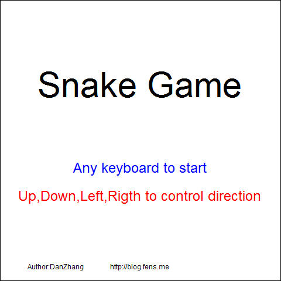
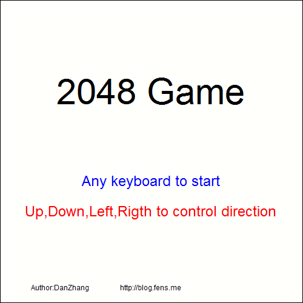
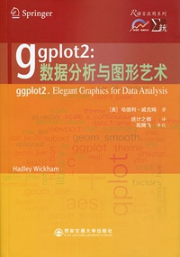
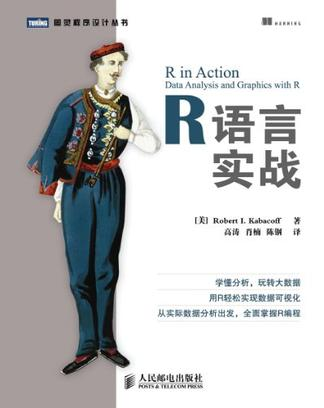
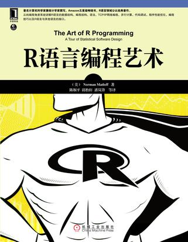
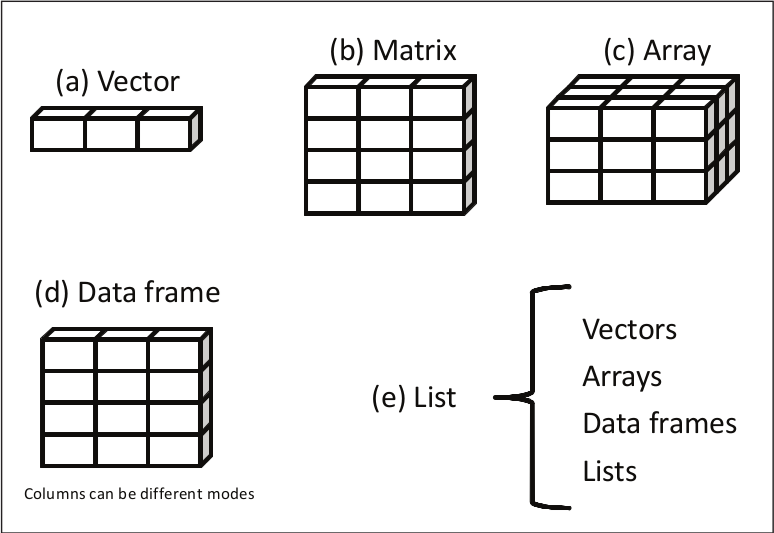
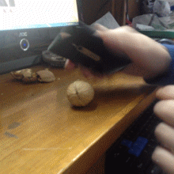
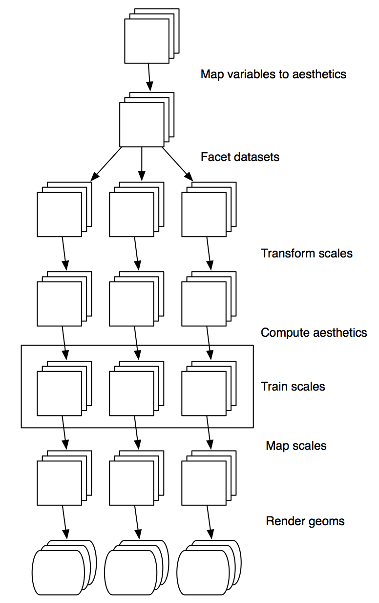

# |[点](https://github.com/gahoo/BGIggplot2Tutorial/)扫我下教程：

# R
## R的历史
* Scheme
    - 一种函数式编程语言，是Lisp的两种主要方言之一
* S-PLUS
    - S语言的一种商业实现
* R
    - S语言的一种开源实现，语法来自Scheme。
    
* Ross Ihaka & Robert Gentlemen
    - 

<aside class="note">
  <section>
  最早的时候，Ross Ihaka、注意到了Scheme和S语言二者之间的异同点，萌生了改进S语言的想法。

  相当长一段时间之后，Ross Ihaka和Robert Gentlemen在奥克兰大学成了同事，因为在商业软件中找不到他们想要的，这使Ross想到当初改进S语言的想法，于是他们决定自己开发一种语言。

  1993年，Ross和Robert将R的部分二进制文件放到了卡耐基·梅隆大学统计系的Statlib中，并在S语言的新闻列表上发布了一个公告。
  Martin极力劝说两位原作者公布源代码，让R成为自由软件。于是1995年6月R的源代码正式发布到了自由软件协会的FTP上。

  1997年中期R核心团队成立  

  从2004年起至今（2005年除外），R团队每年都会举办一次useR!会议，过去已经在奥地利、美国和德国举办了多次会议，每年参会人数和演讲篇数都在增多。

  从2008年至今（2014年9月），统计之都已经在国内举办了7届R语言会议。除了来自大学的学者，百度，京东，腾讯，微软等传统互联网公司也有参会。会议内容涵盖商业、大数据、生物信息等领域
  </section>
</aside>

## R能做什么

- 统计分析：包括统计分布，假设检验，统计建模
- 金融分析：量化策略，投资组合，风险控制，时间序列，波动率
- 数据挖掘：数据挖掘算法，数据建模，机器学习
- 互联网：推荐系统，消费预测，社交网络
- 生物信息学：DNA分析，物种分析
- 生物制药：生存分析，制药过程管理
- 全球地理科学：天气，气候，遥感数据
- 数据可视化：静态图，可交互的动态图，社交图，地图，热图，与各种Javascript库的集成
- 其他：幻灯片，游戏

<aside class="note">
  <section>
    <div style="height:550px;overflow-y: scroll">
  @Conan_Z
  http://blog.fens.me/r-game-snake/
  
  http://blog.fens.me/r-game-2048/
  
  </div>
  </section>
</aside>

## R中的绘图系统
* base

* gird
    - lattice
    - ggplot2

* other
    - vcd
    - plotrix
    - gplots
    - pheatmap

<aside class="note">
  <section>
- base基础图形系统是从S语言中来的，一开始就存在于R语言中。高级绘图函数`plot` `hist` `boxplot`，低级绘图函数`lines` `points` `rect`
- gird网格图形系统是后来加入R中的，与base的最大区别在于，gird能创建多个绘图区域，叫做*viewports*。gird只是一个框架，本身不能够直接绘图
- lattice软件包构建于gird之上，原本是贝尔实验室为S与S-PLUS语言开发的，实现了网格（分面）绘图。
- ggplot2同样采用了gird，吸取了基础绘图系统与lattice的优点，基于图形的语法模型。使得绘图变得便捷可控。
- 其他软件包开发了一些针对特殊需要的图形
  </section>
</aside>

## ggplot2
* Leland Wilkinson
    - The Grammar of Graphics, Springer, 1999.
* Hadley Wickham
    - 2005, ggplot2实现了Grammar of Graphics的基本理念
    
* 设计理念
    - 将图形拆分为相互独立且可以自由组合的组件。
* 好在哪里？
    - 纸笔 VS 语法
    - 手绘（base） VS 美图秀秀（lattice） VS PhotoShop（ggplot2）

<aside class="note">
  <section>
- 基础图形系统类似纸笔，一块画布，指到哪里画哪里。手绘高手也还是存在的……
- lattice略有改善，可以按分类变量给元素上色。但是参数太多。且面向特定的统计图形，如散点图，直方图等。像美图秀秀之类的修图工具，自带各种滤镜或者特效或者添加水印的功能，但其实比美图秀秀强多了。
- ggplot2实现了图形的语法，将图形拆分成为相互独立可互相组合的对象。各种图层的叠加，复制黑客帝国里面的史密斯轻轻松松。
  </section>
</aside>

## SOS 学会求助
- help
```{r,eval=FALSE}
help(qplot)
?qplot
??qplot
```
- 邮件列表
- 社区
    - [StackOverflow](http://stackoverflow.com/)
    - [统计之都](http://cos.name/)

## 参考书目





# R数据结构
## R数据结构


## 向量Vector
```{r}
v_number <- c(1, 2, 5, 3, 6, -2, 4)  #numeric
v_bool <- c(TRUE, TRUE, TRUE, FALSE, TRUE, FALSE)  #logical
v_character <- c("one", "two", "three") #character
v_mix<-c(1,TRUE,"one")
```

```{r}
v_number[v_bool]
v_character[1:2]
v_mix
```

## 向量Vector
```{r}
v_character[c(1,3)]
v1 <- c(1, 1, 1, 1, 1)
v2 <- c(1, 2)
v1 * v2
```
## 矩阵Matrix
```{r}
y <- matrix(1:12, nrow=2, ncol=6) 
y
y <- matrix(1:12, nrow=2, ncol=6, byrow=TRUE) 
y
```

## 数组Array
<div class="columns-2" style="height:500px">
```{r}
a <- 1:12
dim(a) <- c(2,3,2)
a
class(a)
dim(a) <- c(2,6)
class(a)
a <- array(1:12, c(2, 6))
class(a)
```
</div>

<aside class="note">
  <section>
  - 矩阵可以认为是特殊的数组，即维度为2的数组
  - 数组可以是高维度的
  </section>
<aside>

## 列表List
```{r}
g <- "My First List"
h <- c(25, 26, 18, 39)
j <- matrix(1:6, nrow=3)
mylist <- list(title=g, ages=h, j)
mylist 
```
## 数据框Data Frame
```{r}
patientID <- c(1, 2, 3, 4)
age <- c(25, 34, 28, 52)
diabetes <- c("Type1", "Type2", "Type1", "Type1")
patientdata <- data.frame(patientID, age, diabetes)
patientdata$status <- c("Poor", "Improved", "Excellent", "Poor")
patientdata$diabetes <- factor(patientdata$diabetes)
patientdata
```
<aside class="note">
  <section>
  - 数据框就像是excel的工作簿
  - 与矩阵或数组不同，数据框的每一列可以是不同类型
  - 数据框可以算是特化的列表，每个元素都是向量，且向量长度相等
  </section>
</aside>

## R数据结构

<aside class="note">
  <section>
  - 普通的标量就是特殊的向量，即只有一个元素的向量
  - 向量加上维度就成了矩阵或者数组
  - 矩阵是维度为二的数组
  - 向量、矩阵、数组都只能存储一种类型的数据，如果有不同类型的数据会自动转换
  - 数据框就像是excel的工作簿
  - 与矩阵或数组不同，数据框的每一列可以是不同类型
  - 数据框可以算是特化的列表，每个元素都是向量，且向量长度相等
  </section>
</aside>

# 面向对象Object-Oriented
## 面向对象
### 一切皆对象
面向对象是一种对现实世界理解和抽象的方法。是指一种程序设计范型，同时也是一种程序开发的方法。对象指的是类的集合。它将对象作为程序的基本单元，将程序和数据封装其中，以提高软件的重用性、灵活性和扩展性。

### 例如
- 钱包
- 手机
- 钥匙

## 面向对象
### 面向对象的三个特征
- **封装**
    - 把客观事物封装成抽象的类，将独立但相关的数据项目打包在一起，并且类可以把自己的数据和方法只让可信的类或者对象操作，对不可信的进行信息隐藏。
- **继承**
    - 即允许把一个给定的类属性自动赋予其更为下属的更特殊化的类。
- **多态**
    - 指由继承而产生的相关的不同的类，同一函数会对不同的对象做出不同的响应

## 面向对象
### 例如手机
- **封装**
    - 打电话，刷微博，拍照
- **继承**
    - 手机 -> 苹果手机 -> 5S土豪金
    - 手机 -> N记手机  -> Lumia 920
- **多态**
    <div class="columns-2" style="height:250px">
    - 拍照，苹果手机拍出来高上大，小米……
    - 砸核桃，诺基亚毫无压力，苹果……
    <br><br><br>
    
    </div>

## 面向对象
### R语言中的面向对象
- S3：列表加上类名属性和调度（dispatch）功能。后者使得泛型函数的使用变得可能。
- S4：增加了安全性，能避免意外防卫不存在的类组件。
- RC（Reference classes,亦被称为S5）：RC对象系统的方法是在类中自定的，而不是泛型函数。

# ggplot2绘图入门
## ggplot2绘图入门
- 图形的语法
- 图层
- 标度
- 坐标系
- 分面
- 主题

# 图形图层语法
## 图形图层语法
统计图形就是从**数据**到`几何对象`（geomertic object）的`图形属性` （aesthetic attributes）的一个**映射**。此外，图形中还可能包含数据的`统计变换` （statistical transformation），绘制在某个特定的`坐标系` （coordinate system）中，而`分面` （facet）则可以用来生成数据不同子集的图形。上述这些独立的图形部件组成了**统计图形**。

- `几何对象geom`：点、线、面
- `图形属性aes`：颜色、大小、形状
- `统计变换stats`：如分组计数，线性模型等
- `标度scale`：数据到图形空间的映射
- `坐标系coord`：笛卡尔、极坐标、地图投影
- `分面facet`：将数据分解为子集

<aside class="note">
  <section>
  - geom:图形元素
  - stat:对数据的某种汇总
  - scale:将数据的取值映射到图形空间
  - coord:描述了数据如何映射到图形所在平面
  - facet:描述如何将数据分解为子集
  </section>
</aside>

## 绘图过程



## 图层语法的组件
- 图层
    - 数据和`图形属性`映射
	  - 一个`统计变换`
	  - 一种`几何对象`
	  - 一种位置调整方式
- `标度`
- `坐标系`
	  - 笛卡尔
	  - 半对数
	  - 极坐标
- `分面`

<aside class="note">
  <section>
  - **图层**的作用是生成在图像上可被人感知的对象
  - **标度 scale**控制数据到图形属性的映射，图形上所用的每一个图形属性都对应着一个标度。每个标度都作用于图形中的所有数据，取保数据到图形属性映射的一致性。
  - **坐标系 coord**可将对象的位置映射到图形平面上。
  - **分面 facet**条件绘图和网格绘图的一般形式，可以方便地展示数据的不同子集。
  </section>
<aside>

## 图形对象的数据结构
ggplot2中的一个图形对象就是包含以下内容的列表

- 数据
- 映射
- 图层
- 坐标
- 分面
- options（主题）

# 图层
## 图层
- 数据
    - 数据导入
- 图形属性映射
	  - ＋
	  - 设定与映射
	  - 分组
- 几何对象
- 统计变换
- 位置调整

## 数据
ggplot2需要用数据框作为数据集，而分组时必须根据行而不能根据列。因此有时候需要用`reshape2`包将“宽”数据变成“长”数据，即将变量排成一列而不是放在不同的列上。`melt()`函数可以方便地将“宽”数据“溶解”成“长”数据，`cast()`函数能够将“溶解”了的数据框重新整理成需要的样子。
```{r}
library(reshape2)
fqcheck<-read.table('datasets/1.fqcheck',row.names=NULL,header=T)
#fqcheck$Pos<-factor(fqcheck$Pos)
base_comp<-melt(fqcheck[,1:6],id="Pos")
```
### fqcheck
<div style="height:300px;width=600px;overflow: scroll">
```{r,echo=FALSE}
renderDataTable(fqcheck)
```
</div>

## 数据
```{r, echo=FALSE, results = 'asis'}
library(knitr)
kable(head(fqcheck[,1:6]), format='html', caption = "Before Melt (fqcheck[,1:6])", 
      align='c', table.attr = 'width="600"')
HTML('<hr>')
kable(head(base_comp), format='html', caption = "After Melt (base_comp)",
      align='c', table.attr = 'width="600"')
```

## 数据
```{r}
library(ggplot2)
p<-ggplot(base_comp, aes(x=Pos, y=value))
p+geom_point()
```


```{r, echo=F}
buildCodesHtml<-function(src, outputName, opts=c("eval=F", "echo=T")){
  library(knitr)
  opts<-paste(opts, sep="", collapse=", ")
  src=paste(
    sprintf("```{r, %s}",opts),
    src,
    "```", sep = '\n')
  opts_knit$set(progress = FALSE)
  if (length(src) == 0L || src == '')
    return('Nothing to show yet...')
  on.exit(unlink('figure/', recursive = TRUE)) # do not need the figure dir
  highlight<-sprintf("$('#%s pre code').each(function(i, e) {hljs.highlightBlock(e)});", outputName)
  paste(try(knit2html(text = src, fragment.only = TRUE)),
        '<script>',
        '// highlight code blocks',
        highlight,
        'MathJax.Hub.Typeset(); // update MathJax expressions',
        '</script>', sep = '\n')
}
```

## 图层
- 数据
    - 数据导入
- 图形属性映射
    - ＋
	  - 设定与映射
	  - 分组
- 几何对象
- 统计变换
- 位置调整

## 图形属性映射
`aes()`函数用来将数据变量映射到图形中，从而使变量成为可感知的图形属性。
```{r,echo=FALSE}
inputPanel(
  selectInput("aes_colour", label = "colour:",
              choices = c('NULL',names(base_comp)), selected = 'NULL'),
  selectInput("aes_fill", label = "fill:",
              choices = c('NULL', names(base_comp)), selected = 'NULL'),
  selectInput("aes_size", label = "size:",
              choices = c('NULL', names(base_comp)), selected = 'NULL')
  #selectInput("aes_linetype", label = "linetype:",
  #            choices = c('NULL', names(base_comp)), selected = 'variable')
)


src_aes= reactive({sprintf(
  "pp <- p + aes(colour=%s, fill=%s, size=%s)
pp + geom_point()",
  input$aes_colour,input$aes_fill,
  #input$aes_linetype,
  input$aes_size)})

codes_aes=reactive({
  buildCodesHtml(src_aes(), "codes_aes",
                 opts=c("eval=F", "echo=T",
                        "background='#000000'", #useless
                        "tidy.opts=list(width.cutoff=32)"))})
renderUI({HTML(codes_aes())})
```

<aside class="note">
  <section>
```{r,echo=FALSE,fig.width=4,fig.height=7}
renderPlot({
    print(p + aes_string(colour=input$aes_colour, fill=input$aes_fill,
              size=input$aes_size) + geom_point())
    })
```
  </section>
</aside>

## +
如前例所示，默认的图形属性映射可以在初始化时设置，也可以后来用`+`修改。`+` 很好地体现了图层的概念。
```{r,echo=FALSE}
inputPanel(
  selectInput("plus_colour", label = "colour:",
              choices = c('NULL',names(base_comp)), selected = 'NULL'),
  selectInput("plus_fill", label = "fill:",
              choices = c('NULL', names(base_comp)), selected = 'NULL'),
  selectInput("plus_size", label = "size:",
              choices = c('NULL', names(base_comp)), selected = 'NULL'),
  selectInput("plus_linetype", label = "linetype:",
              choices = c('NULL', names(base_comp)), selected = 'variable'),
  checkboxInput("plus_point", "geom_point",value=TRUE),
  checkboxInput("plus_line", "geom_line",value=FALSE)
)


src_plus= reactive({
plus_line=ifelse(input$plus_line,
                 sprintf(" + geom_line(aes(linetype=%s))",
                      input$plus_linetype),
                 "")
plus_point=ifelse(input$plus_point," + geom_point()","")
  sprintf(
  "pp <- p + aes(colour=%s, fill=%s, size=%s)
pp%s%s",
  input$plus_colour,input$plus_fill,
  input$plus_size, plus_point, plus_line)})

codes_plus=reactive({
  buildCodesHtml(src_plus(), "codes_plus",
                 opts=c("eval=F", "echo=T",
                        "background='#000000'", #useless
                        "tidy.opts=list(width.cutoff=32)"))})
renderUI({HTML(codes_plus())})
```

<aside class="note">
  <section>
```{r,echo=FALSE,fig.width=4,fig.height=7}
renderPlot({
    pl<-p + aes_string(colour=input$plus_colour, fill=input$plus_fill,
              size=input$plus_size)
    if(input$plus_line){
      pl <- pl+geom_line(aes_string(linetype=input$plus_linetype))
    }
    if(input$plus_point){
      pl <- pl+geom_point()
    }
    print(pl)
    })
```
  </section>
</aside>

## 分组
图中所有的离散型变量的交互作用被设为分组的默认值，但有时候不能正确分组或图中没有离散型变量，就需要自定义分组。
<div class="columns-2" style="height:50%">
```{r,fig.align="center",fig.width=5,fig.height=4}
pg <- ggplot(base_comp, 
        aes(x=Pos, y=value))+
  geom_line()
pg
#
#
#
pg + aes(group=variable)
```
<div>

## 图层
- 数据
    - 数据导入
- 图形属性映射
    - ＋
    - 设定与映射
	  - 分组
- 几何对象
- 统计变换
- 位置调整

## 几何对象
执行图层的实际渲染，控制生成的图像类型。每个几何对象都有一组图形属性。每个几何对象都有一个默认的统计变换，每个统计变换都有一个默认的几何对象。
<div style="height:500px;overflow: scroll;"
```{r,echo=FALSE}
#func_names<-ls(getNamespace("ggplot2"))
#func_geom<-func_names[grep("^geom",func_names)]
#func_geom<-func_geom[!func_geom %in% c("geom_aesthetics")]
#func_geom_args<-unlist(lapply(func_geom,function(x){paste(names(formals(x)),collapse=", ")}))
#func_geom_df<-data.frame(names=func_geom, aesthetics=func_geom_args)
func_geom_df<-read.delim('datasets/geom_desc.table.txt',
                         sep='\t',as.is=TRUE,header=TRUE)
renderDataTable(func_geom_df, 
                options = list(bPaginate = FALSE,
                               bFilter = FALSE))
```
</div>

## 几何对象
```{r,echo=FALSE}
#head(func_geom_df)
selection<-list()
selection[['point']]<-list(x='Pos',y='value')
selection[['point']][['x']]

buildUI<-function(func){
  aesthetics<-func_geom_df$Aesthetics[func_geom_df$Name==func]
  aesthetics<-unlist(strsplit(aesthetics,split=', '))
  lapply(aesthetics, function(aesth){
    aes_id<-paste("geom",aesth,sep="_")
    selected<-ifelse(aesth %in% c('x'),'Pos','NULL')
    #selected<-ifelse(aesth %in% c('y'),'value','NULL')
    selectInput(aes_id, aesth,
                choices = c('NULL', names(base_comp)),
                selected = selected)
  })
}

aes_Strings<-reactive({
  aesthetics<-func_geom_df$Aesthetics[func_geom_df$Name==input$geom]
  aesthetics<-unlist(strsplit(aesthetics,split=', '))
  aesStrings<-lapply(aesthetics, function(aesth){
    value<-input[[paste("geom", aesth, sep='_')]]
    message(value)
    value
  })
  names(aesStrings)<-aesthetics
  message(aesStrings)
  aesStrings
})

geoms<-c('point','line','area','bar','boxplot','tile')

inputPanel(
  selectInput("geom", label = "geom:",
              choices = c('NULL',geoms), selected = 'point'),
  renderUI({buildUI(input$geom)})
)

renderPlot({
  pa<-ggplot(base_comp, aes(x=Pos, y=value))
  func<-paste("geom",input$geom,sep='_')
  try(print(pa + do.call(aes_string,aes_Strings()) + do.call(func,list())))
})
```

## 统计变换
## 位置调整

## 图层
- 数据
    - 数据导入
- 图形属性映射
    - ＋
    - 设定与映射
    - 分组
- 几何对象
- 统计变换
- 位置调整

# 标度
# 坐标系
# 分面
# 主题


## geom
The `geom` objects render the layers. Controlling the plot types. Every `geom` has it's own _Aesthetics_, which modifies how the `geom` looks like.

* `geom_line`
* `geom_point`
* `geom_area`
* `geom_bar`
* `geom_boxplot`
* `geom_tile`
* <del>`geom_pie`</del>

```{r, echo=F}
buildCodesHtml<-function(src, outputName, opts=c("eval=F", "echo=T")){
  library(knitr)
  opts<-paste(opts, sep="", collapse=", ")
  src=paste(
    sprintf("```{r, %s}",opts),
    src,
    "```", sep = '\n')
  opts_knit$set(progress = FALSE)
  if (length(src) == 0L || src == '')
    return('Nothing to show yet...')
  on.exit(unlink('figure/', recursive = TRUE)) # do not need the figure dir
  highlight<-sprintf("$('#%s pre code').each(function(i, e) {hljs.highlightBlock(e)});", outputName)
  paste(try(knit2html(text = src, fragment.only = TRUE)),
        '<script>',
        '// highlight code blocks',
        highlight,
        'MathJax.Hub.Typeset(); // update MathJax expressions',
        '</script>', sep = '\n')
}
```

## Dataset
The dataset we used to demonstrate is fqcheck which is very common and simple. First we have to load the data into R.
```{r}
library(reshape2)
fqcheck<-read.table('datasets/1.fqcheck',row.names=NULL,header=T)
#fqcheck$Pos<-factor(fqcheck$Pos)
base_comp<-melt(fqcheck[,1:6],id="Pos")
head(base_comp)
```
<aside class="note">
  <section>
```{r, echo=FALSE, results = 'asis'}
library(knitr)
kable(head(fqcheck[,1:6]), format='html', caption = "Before Melt (fqcheck[,1:6])", 
      align='c', table.attr = 'width="600"')
HTML('<hr>')
kable(head(base_comp), format='html', caption = "After Melt (base_comp)",
      align='c')
```
  </section>
</aside>

## `geom_line`
The data maps to the attribues of `geom`. As we change the _Aesthetics_, the plot changes.
```{r, echo=FALSE}
inputPanel(
  selectInput("line_color", label = "colour:",
              choices = c('NULL',names(base_comp)), selected = 'NULL'),
  selectInput("line_fill", label = "fill:",
              choices = c('NULL', names(base_comp)), selected = 'NULL'),
  selectInput("line_size", label = "size:",
              choices = c('NULL', names(base_comp)), selected = 'NULL'),
  selectInput("linetype", label = "linetype:",
              choices = c('NULL', names(base_comp)), selected = 'variable')
)
```
<br>

```{r, echo=FALSE}
library(ggplot2)

src_line = reactive({sprintf("ggplot(base_comp) + 
   geom_line(aes(x=Pos,y=value)) + 
   aes(colour=%s, fill=%s, linetype=%s, size=%s)",
   input$line_color,input$line_fill,input$linetype,input$line_size)})

codes_line=reactive({
  buildCodesHtml(src_line(), "codes_line",
                 opts=c("eval=F", "echo=T",
                        "background='#000000'", #useless
                        "tidy.opts=list(width.cutoff=32)"))})
renderUI({HTML(codes_line())})

```

<aside class="note">
```{r, echo=FALSE}
renderPlot({
  p<-ggplot(base_comp) + 
   geom_line(aes(x=Pos,y=value)) + 
    aes_string(colour=input$line_color, fill=input$line_fill,
               linetype=input$linetype, size=input$line_size)
  print(p)
})
```
</aside>

## `geom_point`
When we want points rather than lines, change `geom_line` to `geom_point`. That's all. What about lines and points togeter? `+` is all you need, multiple layer can be plot with `+`.

```{r, echo=FALSE}
inputPanel(
  selectInput("point_color", label = "colour:",
              choices = c('NULL',names(base_comp)), selected = 'NULL'),
  selectInput("point_fill", label = "fill:",
              choices = c('NULL', names(base_comp)), selected = 'NULL'),
  selectInput("point_size", label = "size:",
              choices = c('NULL', names(base_comp)), selected = 'NULL'),
  selectInput("point_shape", label = "shape:",
              choices = c('NULL', names(base_comp)), selected = 'variable'),
  checkboxInput('geom_line',label = 'geom_line', value = FALSE)
)
```
<br>
```{r, echo=FALSE}
line_src=reactive({
  line_src=''
  if(input$geom_line){
    line_src='geom_line() +\n   '
    }
  line_src
})

src_point = reactive({sprintf("ggplot(base_comp,aes(x=Pos,y=value)) + 
   geom_point() + 
   %saes(colour=%s, fill=%s, shape=%s, size=%s)",line_src(),
   input$point_color,input$point_fill,input$point_shape,input$point_size)})

codes_point=reactive({
  buildCodesHtml(src_point(), "codes_point",
                 opts=c("eval=F", "echo=T",
                        "background='#000000'", #useless
                        "tidy.opts=list(width.cutoff=32)"))})
renderUI({HTML(codes_point())})
```


<aside class="note">
```{r, echo=FALSE}
renderPlot({
  p<-ggplot(base_comp) + 
   geom_point(aes(x=Pos,y=value)) + 
    aes_string(colour=input$point_color, fill=input$point_fill,
               shape=input$point_shape, size=input$point_size)
  if(input$geom_line){
    p<-p+geom_line(aes(x=Pos,y=value))
    }
  print(p)
})
```
</aside>

## `geom_area`
An area plot can be used to show how composition of the whole varies over the range of x. It looks like `geom_line`, but hightlights the composition with aera.
```{r, echo=FALSE}
inputPanel(
  selectInput("aera_color", label = "colour:",
              choices = c('NULL',names(base_comp)), selected = 'NULL'),
  selectInput("aera_fill", label = "fill:",
              choices = c('NULL', names(base_comp)), selected = 'NULL'),
  selectInput("aera_size", label = "size:",
              choices = c('NULL', names(base_comp)), selected = 'NULL'),
  selectInput("aera_linetype", label = "linetype:",
              choices = c('NULL', names(base_comp)), selected = 'variable'),
  selectInput("aera_alpha", label = "alpha:",
              choices = c('NULL', names(base_comp)), selected = 'NULL')
  #sliderInput("aera_alpha_slider", label = "alpha:",
  #            min=1/256, max=1, value=1, animate=TRUE)
)
```
<br>

```{r, echo=FALSE}
src_aera = reactive({sprintf("ggplot(base_comp) + 
   geom_area(aes(x=Pos,y=value)) + 
   aes(colour=%s, fill=%s, linetype=%s, size=%s, alpha=%s)",
   input$aera_color,input$aera_fill,input$aera_linetype,
   input$aera_size,input$aera_alpha)})

codes_aera=reactive({
  buildCodesHtml(src_aera(), "codes_aera",
                 opts=c("eval=F", "echo=T",
                        "background='#000000'", #useless
                        "tidy.opts=list(width.cutoff=32)"))})
renderUI({HTML(codes_aera())})

```

<aside class="note">
```{r, echo=FALSE}
renderPlot({
  p<-ggplot(base_comp) + 
   geom_area(aes(x=Pos,y=value)) + 
    aes_string(colour=input$aera_color, fill=input$aera_fill,
               linetype=input$aera_linetype, size=input$aera_size,
               alpha=input$aera_alpha)
  print(p)
})
```
</aside>

## `geom_bar`
Barplot is commonly used. The default `stat` is `bin`, which counts the variables. But most of the time we need `identity` to map the bar height to a specific variable. `position` controls how the bars place, `stack` or `dodge`.
```{r, echo=FALSE}
inputPanel(
  selectInput("bar_stat", label = "stat:",
              choices = c('bin', 'identity'), selected = 'bin'),
  selectInput("bar_position", label = "position:",
              choices = c('stack', 'dodge'), selected = 'stack'),
  selectInput("bar_fill", label = "fill:",
              choices = c('NULL', names(base_comp)), selected = 'variable'),
  selectInput("bar_weight", label = "weight:",
              choices = c('NULL', names(base_comp)), selected = 'NULL')
)
```
<br>

```{r, echo=FALSE}
bar_src=reactive({
  if(input$bar_stat=='identity'){
    bar_src='aes(x=Pos,y=value)'
  }else{
    bar_src='aes(x=Pos)'
  }
  bar_src
})

src_bar = reactive({sprintf("base_comp_10<-subset(base_comp, Pos<10)
ggplot(base_comp_10, %s) + 
   geom_bar(stat=%s, position=%s) + 
   aes(fill=%s,weight=%s)",bar_src(),
   input$bar_stat, input$bar_position, input$bar_fill, input$bar_weight
   )})

codes_bar=reactive({
  buildCodesHtml(src_bar(), "codes_bar",
                 opts=c("eval=F", "echo=T",
                        "background='#000000'", #useless
                        "tidy.opts=list(width.cutoff=32)"))})
renderUI({HTML(codes_bar())})

```

<aside class="note">
```{r, echo=FALSE}
renderPlot({
  base_comp_10<-subset(base_comp, Pos<10)
  p<-ggplot(base_comp_10)
  if(input$bar_stat=='bin'){
    p<-p+aes(x=Pos)
  }else{
    p<-p+aes(x=Pos,y=value)
  }
   p<- p + geom_bar(stat=input$bar_stat,position=input$bar_position) + 
    aes_string(fill=input$bar_fill, weight=input$bar_weight)
  print(p)
})
```
</aside>

## `geom_boxplot`
In descriptive statistics, a box plot or boxplot is a convenient way of graphically depicting groups of numerical data through their quartiles. Outliers may be plotted as individual points. The default `stat` is `boxplot`, which turn variables into boxplot. When `stat` was set to `identity`, `lower`,`middle`,`upper`,`x`,`ymax`,`ymin` must be feed to `aes()`.

```{r, echo=FALSE}
inputPanel(
  sliderInput("box_Pos", label = "Pos < ", min=1, max=90,
              value=90, step=5, animate = animationOptions(interval=2000)),
  checkboxInput("box_notch", label = "notch", value=FALSE)
)
```
<br>
```{r, echo=FALSE}
src_box = reactive({sprintf("base_comp_sub<-subset(base_comp, Pos<%s)
ggplot(base_comp_sub, aes(x=variable,y=value)) + 
   geom_boxplot(notch=%s, aes(fill=variable))",
   input$box_Pos,input$box_notch
   )})

codes_box=reactive({
  buildCodesHtml(src_box(), "codes_box",
                 opts=c("eval=F", "echo=T",
                        "background='#000000'", #useless
                        "tidy.opts=list(width.cutoff=32)"))})
renderUI({HTML(codes_box())})
```

<aside class="note">
```{r, echo=FALSE}
renderPlot({
  base_comp_10<-subset(base_comp, Pos<input$box_Pos)
  p<-ggplot(base_comp_10,aes(x=variable,y=value))+
    geom_boxplot(notch=input$box_notch) + 
    aes_string(fill='variable')
  print(p)
})
```
</aside>

## `geom_tile`
Before we use `geom_tile`, dataset was `melt` again to feed `ggplot`.
```{r}
base_qual<-fqcheck[c(1,7:48)]
colnames(base_qual)<-c('Pos',0:41)
base_qual<-melt(base_qual,id='Pos')
colnames(base_qual)<-c('Pos', 'Qual', 'value')
head(base_qual)
```
<aside class="note">
  <section>
    <div style="width: 500px; height: 600px;overflow: scroll;">
```{r, echo=FALSE, results='asis'}
kable(fqcheck[c(1,7:48)], format='html', align='c',
      caption = "Before Melt (fqcheck[,c(1,7:48)])")
```
    </div>
  </section>
</aside>

## `geom_tile`
With the `melt`ed dataset, `geom_tile` was able to plot heatmap. Changing the default color is simple. `scale_fill_gradient` or `scale_fill_gradient2` could map *value* to the color filled in the tile. `scal` will be discuss in the next section in detail.

```{r, echo=FALSE}
inputPanel(
  checkboxInput('tile_scale','scale_fill_gradient',value=FALSE),
  textInput('tile_fill_low','low',value='white'),
  textInput('tile_fill_high','high',value='green'),
  checkboxInput('tile_scale2','scale_fill_gradient2',value=FALSE),
  sliderInput('tile_fill_midpoint','midpoint',
              min=min(base_qual$value), max=max(base_qual$value),
              value=mean(base_qual$value))
  )
```

<br>
```{r, echo=FALSE}
tile_src=reactive({
  if(input$tile_scale2){
    return(sprintf("+\n    scale_fill_gradient2(low='%s',high='%s',midpoint=%s)",
            input$tile_fill_low,input$tile_fill_high,input$tile_fill_midpoint))
  }else if(input$tile_scale){
    return(sprintf("+\n    scale_fill_gradient(low='%s',high='%s')",
            input$tile_fill_low,input$tile_fill_high))
  }else{
    return("")
  }
})

src_tile = reactive({sprintf("ggplot(base_qual,aes(x=Pos,y=Qual)) +
    geom_tile(aes(fill=value))%s",tile_src()
   )})

codes_tile=reactive({
  buildCodesHtml(src_tile(), "codes_tile",
                 opts=c("eval=F", "echo=T",
                        "background='#000000'", #useless
                        "tidy.opts=list(width.cutoff=32)"))})
renderUI({HTML(codes_tile())})
```

<aside class="note">
```{r, echo=FALSE}
renderPlot({
  p<-ggplot(base_qual,aes(x=Pos,y=Qual)) +
    geom_tile(aes(fill=value))
  if(input$tile_scale2){
    p<-p + scale_fill_gradient2(low=input$tile_fill_low,high=input$tile_fill_high,midpoint=input$tile_fill_midpoint)
  }else if(input$tile_scale){
    p<-p + scale_fill_gradient(low=input$tile_fill_low,high=input$tile_fill_high)
  }
  print(p)
})
```
</aside>

## <del>`goem_pie`</del>|`goem_bar`
There no *goem_pie* geom object. How to plot an Pie? *DON'T!* Our eyes is more sensitive to _length_ rather than _angle_. Use `geom_bar` instead. But if you really want an Pie, try `coord_polar`.
```{r, echo=FALSE}
inputPanel(
  checkboxInput('pie','pie? no, coord_polar'), value=FALSE)
```

```{r, echo=FALSE}
pie_src=reactive({
  if(input$pie){
    return('+\n  aes(x = factor(1))+\n  coord_polar(theta = "y")')
  }else{
    return("")
  }
})

src_pie = reactive({sprintf("base_comp_0<-subset(base_comp, Pos==0)
ggplot(base_comp_0, aes(x=variable,y=value,fill=variable)) + 
  geom_bar(stat='identity', width=1)%s",pie_src()
   )})

codes_pie=reactive({
  buildCodesHtml(src_pie(), "codes_pie",
                 opts=c("eval=F", "echo=T",
                        "background='#000000'", #useless
                        "tidy.opts=list(width.cutoff=32)"))})
renderUI({HTML(codes_pie())})
subset(base_comp, Pos==0)
```

<aside class="note">
```{r, echo=FALSE}
renderPlot({
  (base_comp_0<-subset(base_comp, Pos==0))
  p<-ggplot(base_comp_0, aes(x=variable,y=value,fill=variable)) + 
    geom_bar(stat='identity', width=1)
  if(input$pie){
    p<-p + aes(x=factor(1))+ coord_polar(theta = "y")
  }
  print(p)
})
```
</aside>

## Summary
- `geom_*` renders layers for `ggplot`.
- The `aes()` mappings connects the data and tells `geom` how to render the layer.
- Each `geom` has it's own *Aesthetics*, such as colors, shapes, size etc. Some is required, while the others is optional. Set by `aes()`
- Every `geom` has a default `stat`. And every `stat` has a default `geom`. `stat` will be discuss later.
- Human eyes is more sensitive to length, not angle.

# Thankyou|Questions?